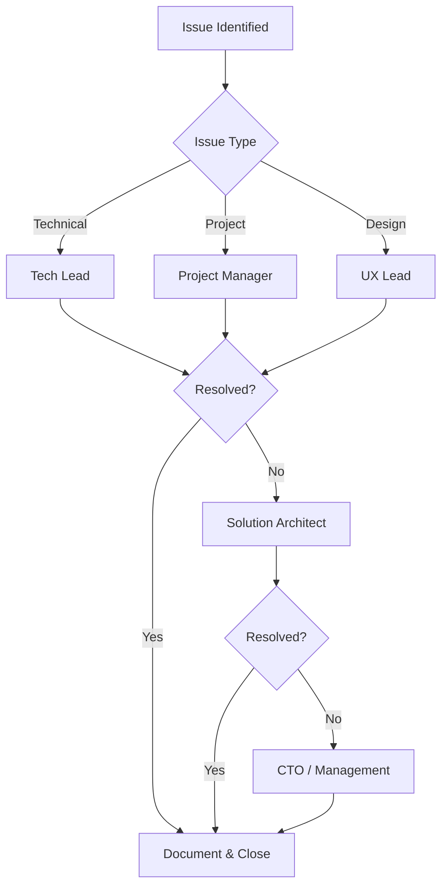

# RACI Matrix

> Project Planning: Responsibility Assignment Matrix

---

## Metadata

```yaml
project: "[PROJECT_NAME]"
version: "1.0"
last_updated: "YYYY-MM-DD"
author: "[PM_NAME]"
status: "Draft"
phase: 1
```

---

## 1. Overview

### 1.1 What is RACI?

RACI is a responsibility assignment matrix that clarifies roles and responsibilities for project activities.

| Letter | Role | Description |
|--------|------|-------------|
| **R** | Responsible | Does the work to complete the task |
| **A** | Accountable | Has final decision authority and accountability |
| **C** | Consulted | Provides input before decision/action (2-way communication) |
| **I** | Informed | Notified after decision/action (1-way communication) |

### 1.2 RACI Rules

- Every task must have exactly **one A** (Accountable)
- Every task must have at least **one R** (Responsible)
- A person can be both R and A for the same task
- Minimize C's to avoid decision delays
- I's should be kept informed but not block progress

---

## 2. Team Roles

### 2.1 Role Definitions

| Role | Abbreviation | Name | Responsibilities |
|------|--------------|------|------------------|
| Project Manager | PM | [Name] | Project planning, timeline, stakeholder communication |
| Solution Architect | SA | [Name] | Technical decisions, architecture, infrastructure |
| Tech Lead | TL | [Name] | Code quality, technical guidance, code review |
| Frontend Developer | FE | [Name] | UI implementation, frontend logic |
| Backend Developer | BE | [Name] | API, database, backend services |
| QA Engineer | QA | [Name] | Testing, quality assurance |
| UX Designer | UX | [Name] | User experience, wireframes, prototypes |
| UI Designer | UI | [Name] | Visual design, design system |
| DevOps | DO | [Name] | CI/CD, infrastructure, deployment |
| Client/Stakeholder | CL | [Name] | Requirements, acceptance, feedback |

---

## 3. RACI Matrix

### 3.1 Project Planning Phase

| Activity | PM | SA | TL | FE | BE | QA | UX | UI | DO | CL |
|----------|----|----|----|----|----|----|----|----|----|----|
| Project kickoff | A/R | C | C | I | I | I | I | I | I | C |
| Requirements gathering | A/R | C | C | I | I | I | C | I | I | R |
| Scope definition | A/R | C | C | I | I | I | I | I | I | C |
| Timeline planning | A/R | C | C | I | I | I | I | I | I | I |
| Resource allocation | A/R | C | C | I | I | I | I | I | I | I |
| Risk assessment | A/R | R | C | I | I | I | I | I | C | I |
| Contract/SOW | A/R | C | I | I | I | I | I | I | I | R |

### 3.2 Design Phase

| Activity | PM | SA | TL | FE | BE | QA | UX | UI | DO | CL |
|----------|----|----|----|----|----|----|----|----|----|----|
| Architecture design | C | A/R | C | C | C | I | I | I | C | I |
| Database design | I | A | R | I | R | I | I | I | I | I |
| API design | I | A | R | C | R | I | I | I | I | I |
| UX research | I | I | I | I | I | I | A/R | I | I | C |
| Wireframes | I | I | I | C | I | I | A/R | C | I | C |
| UI mockups | I | I | I | C | I | I | C | A/R | I | C |
| Design system | I | I | C | C | I | I | C | A/R | I | I |
| Infrastructure design | I | A | C | I | I | I | I | I | R | I |
| Design review | C | A | R | C | C | I | R | R | C | C |

### 3.3 Development Phase

| Activity | PM | SA | TL | FE | BE | QA | UX | UI | DO | CL |
|----------|----|----|----|----|----|----|----|----|----|----|
| Sprint planning | A/R | C | R | C | C | C | I | I | I | I |
| Frontend development | I | I | A | R | I | I | C | C | I | I |
| Backend development | I | I | A | I | R | I | I | I | I | I |
| Code review | I | C | A/R | R | R | I | I | I | I | I |
| Unit testing | I | I | A | R | R | C | I | I | I | I |
| Integration testing | I | C | A | R | R | R | I | I | I | I |
| Bug fixing | I | I | A | R | R | C | I | I | I | I |
| Daily standup | A/R | I | R | R | R | R | I | I | I | I |
| Sprint review | A/R | C | R | R | R | R | I | I | I | C |
| Sprint retrospective | A/R | I | R | R | R | R | I | I | I | I |

### 3.4 Quality Assurance Phase

| Activity | PM | SA | TL | FE | BE | QA | UX | UI | DO | CL |
|----------|----|----|----|----|----|----|----|----|----|----|
| Test planning | C | I | C | I | I | A/R | I | I | I | I |
| Test case creation | I | I | C | I | I | A/R | I | I | I | I |
| Functional testing | I | I | I | I | I | A/R | I | I | I | I |
| Performance testing | I | C | C | I | I | A/R | I | I | C | I |
| Security testing | I | A | C | I | I | R | I | I | C | I |
| UAT coordination | A/R | I | C | I | I | R | I | I | I | R |
| Bug triage | C | I | A | C | C | R | I | I | I | I |
| Test sign-off | C | I | A | I | I | R | I | I | I | C |

### 3.5 Deployment Phase

| Activity | PM | SA | TL | FE | BE | QA | UX | UI | DO | CL |
|----------|----|----|----|----|----|----|----|----|----|----|
| Release planning | A/R | C | R | I | I | C | I | I | R | I |
| Environment setup | I | A | C | I | I | I | I | I | R | I |
| CI/CD pipeline | I | A | C | I | I | I | I | I | R | I |
| Staging deployment | I | C | C | I | I | R | I | I | A/R | I |
| Production deployment | A | C | C | I | I | C | I | I | R | I |
| Rollback execution | I | A | C | I | I | I | I | I | R | I |
| Post-deploy verification | I | C | C | I | I | R | I | I | A/R | I |
| Release notes | A/R | I | C | I | I | I | I | I | I | I |

### 3.6 Support & Maintenance Phase

| Activity | PM | SA | TL | FE | BE | QA | UX | UI | DO | CL |
|----------|----|----|----|----|----|----|----|----|----|----|
| Production support | C | C | A | R | R | I | I | I | R | C |
| Incident response | I | A | R | R | R | I | I | I | R | I |
| Bug prioritization | A/R | C | C | I | I | C | I | I | I | C |
| Hotfix deployment | I | A | R | R | R | C | I | I | R | I |
| Monitoring & alerts | I | A | C | I | I | I | I | I | R | I |
| Documentation update | C | C | A | R | R | I | I | I | I | I |
| Client feedback | A/R | I | C | I | I | I | C | C | I | R |

---

## 4. Decision Authority Matrix

### 4.1 Technical Decisions

| Decision Type | Final Authority | Must Consult |
|---------------|-----------------|--------------|
| Architecture changes | SA | TL, DevOps |
| Tech stack selection | SA | TL, CTO |
| Database schema | SA | TL, BE |
| API contracts | TL | SA, FE, BE |
| Frontend framework | TL | FE, SA |
| Third-party integrations | SA | TL, PM |
| Security implementation | SA | TL, DevOps |

### 4.2 Project Decisions

| Decision Type | Final Authority | Must Consult |
|---------------|-----------------|--------------|
| Scope changes | PM | SA, TL, Client |
| Timeline changes | PM | SA, TL, Client |
| Resource allocation | PM | SA, TL |
| Priority changes | PM | TL, Client |
| Go/No-Go release | PM | SA, TL, QA |
| Budget allocation | PM | Client, Management |

### 4.3 Design Decisions

| Decision Type | Final Authority | Must Consult |
|---------------|-----------------|--------------|
| UX flows | UX | PM, Client |
| Visual design | UI | UX, PM, Client |
| Design system | UI | UX, FE |
| Branding application | UI | PM, Client |
| Accessibility standards | UX | QA, FE |

---

## 5. Escalation Path

### 5.1 Escalation Matrix



### 5.2 Escalation Contacts

| Level | Role | Contact | Response Time |
|-------|------|---------|---------------|
| L1 | Tech Lead / PM | [Name] | 4 hours |
| L2 | Solution Architect | [Name] | 8 hours |
| L3 | CTO / Director | [Name] | 24 hours |

---

## 6. Communication Matrix

### 6.1 Meeting Schedule

| Meeting | Frequency | Attendees | Owner |
|---------|-----------|-----------|-------|
| Daily Standup | Daily | Dev team | TL |
| Sprint Planning | Bi-weekly | All team | PM |
| Sprint Review | Bi-weekly | Team + Client | PM |
| Architecture Review | As needed | SA, TL, DO | SA |
| Design Review | As needed | UX, UI, PM, Client | UX |
| Client Status Update | Weekly | PM, Client | PM |

### 6.2 Communication Channels

| Channel | Purpose | Participants |
|---------|---------|--------------|
| Slack #[project]-dev | Daily dev communication | Dev team |
| Slack #[project]-general | General updates | All team |
| Email | Formal communication | All + Client |
| Jira/Linear | Task tracking | All team |
| Figma | Design collaboration | Design + FE |

---

## 7. Related Documents

| Document | Location |
|----------|----------|
| Project Plan | `01-planning/project-plans/` |
| Contracts/SOW | `01-planning/contracts/` |
| Meeting Records | `01-planning/meeting-record/` |
| Change Requests | `01-planning/change-requests/` |

---

## 8. Approval

| Role | Name | Signature | Date |
|------|------|-----------|------|
| Project Manager | [Name] | | YYYY-MM-DD |
| Solution Architect | [Name] | | YYYY-MM-DD |
| Client Representative | [Name] | | YYYY-MM-DD |

---

## Document History

| Version | Date | Author | Changes |
|---------|------|--------|---------|
| 1.0 | YYYY-MM-DD | [Name] | Initial document |

---

*Project planning for ISO/IEC 29110-5-1-2 compliance.*
