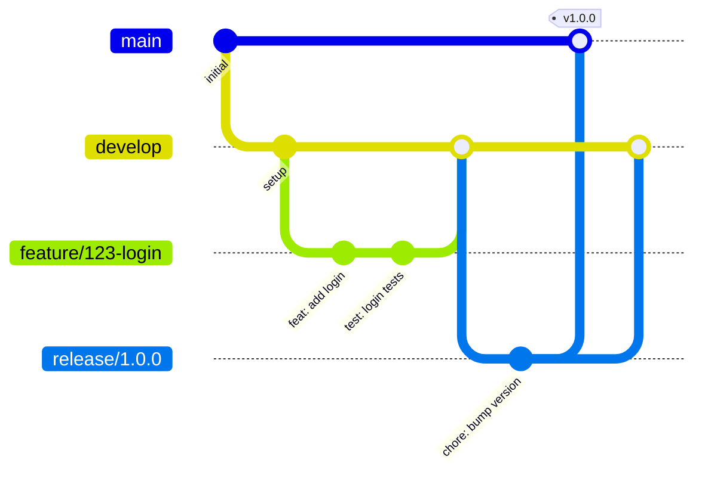

# Repository Structure

> Infrastructure Design: Repository organization and branching strategy

---

## Metadata

```yaml
project: "[PROJECT_NAME]"
version: "1.0"
last_updated: "YYYY-MM-DD"
author: "[SA_NAME]"
status: "Draft"
```

---

## 1. Repository Overview

### 1.1 Repository Naming Convention

| Pattern | Purpose | Example |
|---------|---------|---------|
| `{project}-code` | Application source code | `retouch-code` |
| `{project}-docs` | Project documentation (ISO 29110) | `retouch-docs` |
| `{project}-infra` | Infrastructure as Code (IaC) | `retouch-infra` |
| `{project}-config` | Configuration & secrets templates | `retouch-config` |

### 1.2 Repository List

| Repository | Purpose | Visibility | Team Access |
|------------|---------|------------|-------------|
| `[project]-code` | Main application | Private | Dev, QA |
| `[project]-docs` | Documentation | Private | All |
| `[project]-infra` | Terraform/Pulumi | Private | DevOps, SA |

---

## 2. Branching Strategy

### 2.1 Strategy Type

- [ ] **GitFlow** - Feature branches, develop, release, hotfix
- [ ] **Trunk-Based** - Short-lived feature branches, main only
- [ ] **GitHub Flow** - Feature branches → main with PR

### 2.2 Branch Naming Convention

| Branch Type | Pattern | Example |
|-------------|---------|---------|
| Feature | `feature/{issue-id}-{short-desc}` | `feature/123-user-login` |
| Bugfix | `fix/{issue-id}-{short-desc}` | `fix/456-null-pointer` |
| Hotfix | `hotfix/{version}-{short-desc}` | `hotfix/1.2.1-payment-crash` |
| Release | `release/{version}` | `release/1.3.0` |
| Chore | `chore/{short-desc}` | `chore/update-deps` |

### 2.3 Branch Diagram



---

## 3. Branch Protection Rules

### 3.1 Main Branch (`main`)

| Rule | Value |
|------|-------|
| Require PR | Yes |
| Required reviewers | [X] |
| Require status checks | Yes |
| Required checks | `build`, `test`, `lint` |
| Require up-to-date | Yes |
| Restrict push | Admins only |
| Allow force push | No |
| Allow deletions | No |

### 3.2 Develop Branch (`develop`)

| Rule | Value |
|------|-------|
| Require PR | Yes |
| Required reviewers | [X] |
| Require status checks | Yes |
| Required checks | `build`, `test` |

---

## 4. Repository Structure

### 4.1 Monorepo vs Multi-repo

- [ ] **Monorepo** - All services in one repository
- [ ] **Multi-repo** - Separate repository per service
- [ ] **Hybrid** - Shared libs monorepo + service repos

### 4.2 Standard Directory Layout

```
{project}-code/
├── .github/
│   ├── workflows/           # CI/CD pipelines
│   ├── CODEOWNERS           # Code ownership
│   └── pull_request_template.md
├── src/                     # Source code
│   ├── api/                 # Backend API
│   ├── web/                 # Frontend
│   └── shared/              # Shared libraries
├── tests/                   # Test files
│   ├── unit/
│   ├── integration/
│   └── e2e/
├── docs/                    # Technical docs (API, architecture)
├── scripts/                 # Build/deploy scripts
├── docker/                  # Dockerfiles
├── .env.example             # Environment template
├── docker-compose.yml       # Local development
└── README.md
```

### 4.3 Documentation Repository Layout

```
{project}-docs/
├── 01-planning/
├── 02-requirements/
├── 03-design/
├── 04-development/
├── 05-quality/
├── 06-support/
└── README.md
```

---

## 5. Code Ownership

### 5.1 CODEOWNERS File

```
# .github/CODEOWNERS

# Default owners
* @[team-slug]

# Backend
/src/api/ @[backend-team]

# Frontend
/src/web/ @[frontend-team]

# Infrastructure
/docker/ @[devops-team]
/.github/workflows/ @[devops-team]

# Documentation
/docs/ @[tech-lead]
```

### 5.2 Ownership Matrix

| Path | Owner | Backup |
|------|-------|--------|
| `/src/api/` | [Backend Lead] | [Backend Dev] |
| `/src/web/` | [Frontend Lead] | [Frontend Dev] |
| `/.github/` | [DevOps] | [SA] |
| `/docs/` | [Tech Lead] | [SA] |

---

## 6. PR & Merge Rules

### 6.1 Pull Request Template

```markdown
## Description
[What does this PR do?]

## Related Issue
Closes #[issue-number]

## Type of Change
- [ ] Feature
- [ ] Bug fix
- [ ] Refactor
- [ ] Documentation

## Checklist
- [ ] Tests added/updated
- [ ] Documentation updated
- [ ] No breaking changes
```

### 6.2 Merge Strategy

| Branch | Strategy | Reason |
|--------|----------|--------|
| Feature → Develop | Squash merge | Clean history |
| Develop → Release | Merge commit | Preserve commits |
| Release → Main | Merge commit | Full history |
| Hotfix → Main | Merge commit | Traceability |

---

## 7. Repository Access

### 7.1 Team Permissions

| Team | `{project}-code` | `{project}-docs` | `{project}-infra` |
|------|------------------|------------------|-------------------|
| Developers | Write | Read | Read |
| QA | Read | Write | Read |
| DevOps | Admin | Read | Admin |
| SA | Admin | Admin | Admin |
| PM | Read | Write | - |

### 7.2 External Collaborators

| Collaborator | Repository | Permission | Expiry |
|--------------|------------|------------|--------|
| [Name] | [Repo] | [Read/Write] | [Date] |

---

## 8. Repository Settings

### 8.1 General Settings

| Setting | Value |
|---------|-------|
| Default branch | `main` |
| Allow merge commits | Yes |
| Allow squash merging | Yes |
| Allow rebase merging | No |
| Auto-delete head branches | Yes |
| Require signed commits | [Yes/No] |

### 8.2 Security Settings

| Setting | Value |
|---------|-------|
| Dependency alerts | Enabled |
| Dependabot | Enabled |
| Secret scanning | Enabled |
| Code scanning | [Enabled/Disabled] |

---

## 9. Related Documents

| Document | Location |
|----------|----------|
| Secrets Management | `02-secrets-management.md` |
| CI/CD Pipelines | `03-ci-cd-pipelines.md` |
| Developer Onboarding | `04-developer-onboarding.md` |

---

## Document History

| Version | Date | Author | Changes |
|---------|------|--------|---------|
| 1.0 | YYYY-MM-DD | [Name] | Initial structure |

---

*Infrastructure design for ISO/IEC 29110-5-1-2 compliance.*
