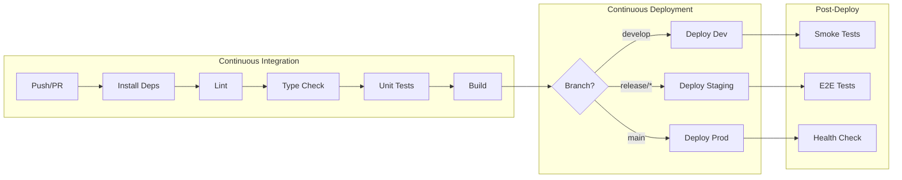

# CI/CD Pipelines

> Infrastructure Design: Continuous Integration and Deployment pipelines

---

## Metadata

```yaml
project: "[PROJECT_NAME]"
version: "1.0"
last_updated: "YYYY-MM-DD"
author: "[SA_NAME]"
status: "Draft"
```

---

## 1. Pipeline Overview

### 1.1 CI/CD Platform

- [ ] **GitHub Actions** - Native GitHub integration
- [ ] **GitLab CI** - GitLab native
- [ ] **CircleCI** - Cloud CI/CD
- [ ] **Jenkins** - Self-hosted
- [ ] **Azure DevOps** - Microsoft ecosystem

### 1.2 Pipeline Types

| Pipeline | Trigger | Purpose |
|----------|---------|---------|
| CI (Build & Test) | Push, PR | Validate code quality |
| CD (Deploy) | Merge to main/release | Deploy to environments |
| Scheduled | Cron | Security scans, cleanup |
| Manual | Button | Hotfix, rollback |

---

## 2. Pipeline Architecture

### 2.1 Flow Diagram



### 2.2 Environment Flow

```
Feature Branch → develop → staging → main (production)
      ↓              ↓          ↓           ↓
   PR Tests      Dev Env   Staging Env   Production
```

---

## 3. CI Pipeline (Build & Test)

### 3.1 Stages

| Stage | Tools | Duration | Required |
|-------|-------|----------|----------|
| Install | npm/yarn/pnpm | ~1 min | Yes |
| Lint | ESLint, Prettier | ~30 sec | Yes |
| Type Check | TypeScript | ~1 min | Yes |
| Unit Tests | Jest/Vitest | ~2-5 min | Yes |
| Integration Tests | Jest + DB | ~3-5 min | Yes |
| Build | Webpack/Vite | ~2 min | Yes |
| Security Scan | npm audit, Snyk | ~1 min | Yes |

### 3.2 GitHub Actions Example

```yaml
# .github/workflows/ci.yml
name: CI

on:
  push:
    branches: [develop, main]
  pull_request:
    branches: [develop, main]

jobs:
  build-and-test:
    runs-on: ubuntu-latest

    steps:
      - uses: actions/checkout@v4

      - name: Setup Node.js
        uses: actions/setup-node@v4
        with:
          node-version: '20'
          cache: 'npm'

      - name: Install dependencies
        run: npm ci

      - name: Lint
        run: npm run lint

      - name: Type check
        run: npm run type-check

      - name: Unit tests
        run: npm run test:unit -- --coverage

      - name: Build
        run: npm run build

      - name: Upload coverage
        uses: codecov/codecov-action@v3
```

### 3.3 Quality Gates

| Gate | Threshold | Action on Fail |
|------|-----------|----------------|
| Lint errors | 0 | Block merge |
| Type errors | 0 | Block merge |
| Test coverage | > 80% | Block merge |
| Unit test pass | 100% | Block merge |
| Security vulns (critical) | 0 | Block merge |
| Security vulns (high) | 0 | Warning |
| Build success | Required | Block merge |

---

## 4. CD Pipeline (Deployment)

### 4.1 Deployment Stages

| Environment | Trigger | Approval | Rollback |
|-------------|---------|----------|----------|
| Development | Push to `develop` | Auto | Auto |
| Staging | Push to `release/*` | Auto | Auto |
| Production | Push to `main` | Manual | Manual |

### 4.2 Deployment Strategy

- [ ] **Rolling Update** - Gradual pod replacement
- [ ] **Blue-Green** - Switch between two environments
- [ ] **Canary** - Gradual traffic shift
- [ ] **Recreate** - Stop old, start new

### 4.3 GitHub Actions Deploy Example

```yaml
# .github/workflows/deploy.yml
name: Deploy

on:
  push:
    branches: [main]

jobs:
  deploy-production:
    runs-on: ubuntu-latest
    environment: production

    steps:
      - uses: actions/checkout@v4

      - name: Configure AWS
        uses: aws-actions/configure-aws-credentials@v4
        with:
          aws-access-key-id: ${{ secrets.AWS_ACCESS_KEY_ID }}
          aws-secret-access-key: ${{ secrets.AWS_SECRET_ACCESS_KEY }}
          aws-region: ap-southeast-1

      - name: Login to ECR
        uses: aws-actions/amazon-ecr-login@v2

      - name: Build and push Docker
        run: |
          docker build -t $ECR_REGISTRY/$ECR_REPO:${{ github.sha }} .
          docker push $ECR_REGISTRY/$ECR_REPO:${{ github.sha }}

      - name: Deploy to ECS
        run: |
          aws ecs update-service \
            --cluster production \
            --service api \
            --force-new-deployment

      - name: Health check
        run: |
          sleep 60
          curl -f https://api.example.com/health
```

---

## 5. Pipeline Secrets

### 5.1 Required Secrets

| Secret | Environment | Purpose |
|--------|-------------|---------|
| `AWS_ACCESS_KEY_ID` | All | AWS authentication |
| `AWS_SECRET_ACCESS_KEY` | All | AWS authentication |
| `DOCKER_REGISTRY_TOKEN` | All | Docker push |
| `SONAR_TOKEN` | CI | Code quality |
| `CODECOV_TOKEN` | CI | Coverage upload |
| `SLACK_WEBHOOK` | All | Notifications |

### 5.2 Environment-Specific

| Secret | Development | Staging | Production |
|--------|-------------|---------|------------|
| `DATABASE_URL` | Dev DB | Staging DB | Prod DB |
| `API_URL` | dev.api.com | staging.api.com | api.com |

---

## 6. Scheduled Pipelines

### 6.1 Schedule Definition

| Pipeline | Schedule | Purpose |
|----------|----------|---------|
| Security Scan | Daily 2am | Vulnerability check |
| Dependency Update | Weekly Mon 3am | Dependabot/Renovate |
| E2E Tests | Daily 4am | Regression testing |
| Database Backup | Daily 1am | Data protection |
| Log Cleanup | Weekly Sun 2am | Storage management |

### 6.2 Cron Example

```yaml
# .github/workflows/security-scan.yml
name: Security Scan

on:
  schedule:
    - cron: '0 2 * * *'  # Daily at 2am UTC

jobs:
  security:
    runs-on: ubuntu-latest
    steps:
      - uses: actions/checkout@v4
      - name: Run Snyk
        uses: snyk/actions/node@master
        env:
          SNYK_TOKEN: ${{ secrets.SNYK_TOKEN }}
```

---

## 7. Notifications

### 7.1 Notification Rules

| Event | Channel | Recipients |
|-------|---------|------------|
| PR Build Failed | Slack #dev | PR author |
| Deploy to Staging | Slack #releases | QA team |
| Deploy to Production | Slack #releases | All |
| Security Alert | Slack #security | DevOps, SA |
| Pipeline Timeout | Slack #dev | DevOps |

### 7.2 Slack Integration

```yaml
- name: Notify Slack
  uses: 8398a7/action-slack@v3
  with:
    status: ${{ job.status }}
    fields: repo,message,commit,author,action,eventName
  env:
    SLACK_WEBHOOK_URL: ${{ secrets.SLACK_WEBHOOK }}
  if: always()
```

---

## 8. Caching & Optimization

### 8.1 Cache Strategy

| Cache Target | Key Pattern | TTL |
|--------------|-------------|-----|
| npm dependencies | `npm-${{ hashFiles('package-lock.json') }}` | 7 days |
| Build artifacts | `build-${{ github.sha }}` | 1 day |
| Docker layers | `docker-${{ hashFiles('Dockerfile') }}` | 7 days |

### 8.2 Parallel Jobs

```yaml
jobs:
  lint:
    runs-on: ubuntu-latest
    steps: [...]

  test:
    runs-on: ubuntu-latest
    steps: [...]

  build:
    needs: [lint, test]  # Wait for both
    runs-on: ubuntu-latest
    steps: [...]
```

---

## 9. Rollback Procedure

### 9.1 Automatic Rollback

| Condition | Action |
|-----------|--------|
| Health check fails | Rollback to previous version |
| Error rate > 5% | Rollback + alert |
| Deploy timeout | Rollback + investigate |

### 9.2 Manual Rollback

```bash
# Option 1: Revert commit and push
git revert HEAD
git push origin main

# Option 2: Deploy specific tag
gh workflow run deploy.yml -f version=v1.2.3

# Option 3: AWS ECS specific
aws ecs update-service \
  --cluster production \
  --service api \
  --task-definition api:123  # Previous version
```

---

## 10. Pipeline Inventory

### 10.1 Active Pipelines

| Pipeline | File | Trigger | Status |
|----------|------|---------|--------|
| CI | `.github/workflows/ci.yml` | PR, Push | Active |
| Deploy Dev | `.github/workflows/deploy-dev.yml` | Push develop | Active |
| Deploy Staging | `.github/workflows/deploy-staging.yml` | Push release/* | Active |
| Deploy Prod | `.github/workflows/deploy-prod.yml` | Push main | Active |
| Security | `.github/workflows/security.yml` | Daily | Active |

---

## 11. Related Documents

| Document | Location |
|----------|----------|
| Repository Structure | `01-repository-structure.md` |
| Secrets Management | `02-secrets-management.md` |
| Developer Onboarding | `04-developer-onboarding.md` |

---

## Document History

| Version | Date | Author | Changes |
|---------|------|--------|---------|
| 1.0 | YYYY-MM-DD | [Name] | Initial document |

---

*Infrastructure design for ISO/IEC 29110-5-1-2 compliance.*
