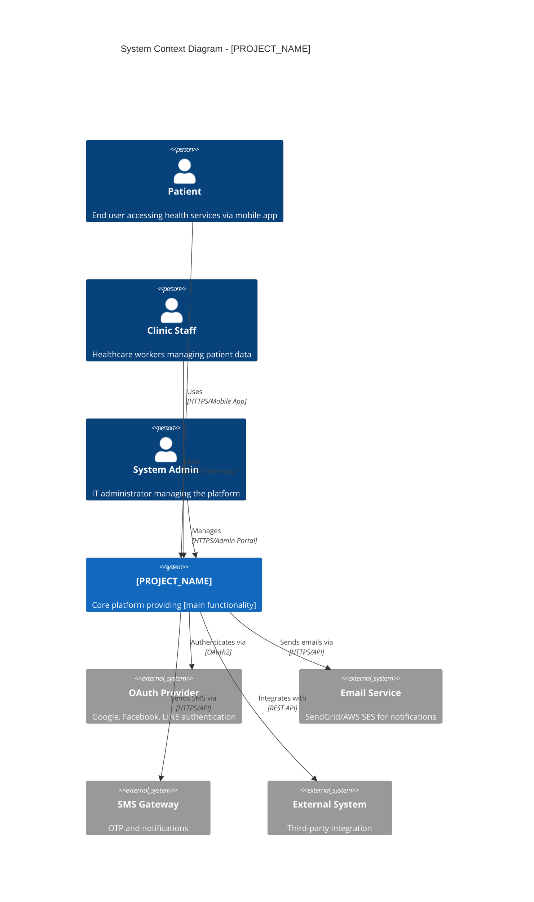

# System Context Diagram (C4 Level 1)

> ISO/IEC 29110-5-1-2 Work Product: Software Design - System Context

---

## Metadata

```yaml
project: "[PROJECT_NAME]"
version: "1.0"
last_updated: "YYYY-MM-DD"
author: "[NAME]"
status: "Draft"
```

---

## Purpose

This document describes the system context - how [PROJECT_NAME] fits into the world around it. It shows the system as a black box, focusing on its relationships with users and external systems.

---

## System Context Diagram



---

## Context Description

### System Overview
| Attribute | Description |
|-----------|-------------|
| **System Name** | [PROJECT_NAME] |
| **Purpose** | [One sentence describing what the system does] |
| **Primary Users** | [List of main user types] |
| **Key Capabilities** | [3-5 main capabilities] |

### Users (Actors)

| Actor | Description | Primary Interactions |
|-------|-------------|---------------------|
| [Patient] | [Description] | [What they do with the system] |
| [Clinic Staff] | [Description] | [What they do with the system] |
| [Admin] | [Description] | [What they do with the system] |

### External Systems

| System | Purpose | Interface Type | Owner |
|--------|---------|----------------|-------|
| [OAuth Provider] | Authentication | OAuth2 | Third-party |
| [Email Service] | Notifications | REST API | Third-party |
| [SMS Gateway] | OTP/Notifications | REST API | Third-party |
| [External System] | [Purpose] | [Type] | [Owner] |

---

## Key Interactions

### Inbound Interactions
| From | To | Description | Protocol |
|------|----|-----------| ---------|
| Patient | System | Access mobile app | HTTPS |
| Clinic Staff | System | Manage patients | HTTPS |
| External System | System | Send data | Webhook |

### Outbound Interactions
| From | To | Description | Protocol |
|------|----|-----------| ---------|
| System | Email Service | Send emails | HTTPS |
| System | SMS Gateway | Send OTP | HTTPS |
| System | External System | Fetch data | REST |

---

## Boundaries

### In Scope (This System)
- [Capability 1]
- [Capability 2]
- [Capability 3]

### Out of Scope (External)
- [What the external systems handle]
- [What other systems are responsible for]

---

## Security Boundary

```
┌─────────────────────────────────────────────────────────────┐
│                      INTERNET                                │
│  ┌─────────┐  ┌─────────┐  ┌─────────┐                      │
│  │ Patient │  │  Staff  │  │  Admin  │                      │
│  └────┬────┘  └────┬────┘  └────┬────┘                      │
└───────┼────────────┼────────────┼───────────────────────────┘
        │            │            │
        ▼            ▼            ▼
┌─────────────────────────────────────────────────────────────┐
│                    TRUST BOUNDARY                            │
│  ┌──────────────────────────────────────────────────────┐   │
│  │                [PROJECT_NAME]                         │   │
│  │  - Authentication required                            │   │
│  │  - All traffic encrypted (TLS 1.2+)                  │   │
│  │  - Role-based access control                         │   │
│  └──────────────────────────────────────────────────────┘   │
└─────────────────────────────────────────────────────────────┘
```

---

## Related Documents

- **Container Diagram:** `02-container-architecture.md`
- **Requirements:** `02-requirements/specifications/`
- **Security Architecture:** `06-security-architecture.md`

---

## Document History

| Version | Date | Author | Changes |
|---------|------|--------|---------|
| 1.0 | YYYY-MM-DD | [Name] | Initial context |

---

*Diagram follows C4 Model Level 1 (System Context) format.*
