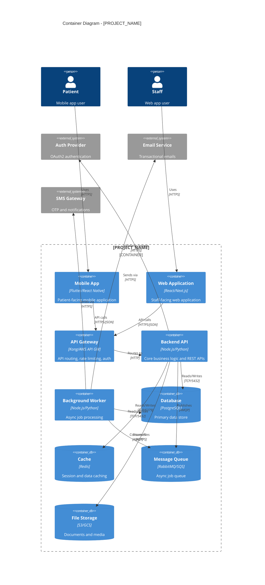

# Container Architecture (C4 Level 2)

> ISO/IEC 29110-5-1-2 Work Product: Software Design - Container Architecture

---

## Metadata

```yaml
project: "[PROJECT_NAME]"
version: "1.0"
last_updated: "YYYY-MM-DD"
author: "[NAME]"
status: "Draft"
```

---

## Purpose

This document zooms into [PROJECT_NAME] to show the high-level containers (applications, services, databases) that make up the system and how they interact.

---

## Container Diagram



---

## Container Descriptions

### Frontend Containers

| Container | Technology | Purpose | Scaling |
|-----------|------------|---------|---------|
| **Mobile App** | [Flutter/React Native] | Patient mobile interface | N/A (client-side) |
| **Web App** | [React/Next.js] | Staff web interface | CDN + Static hosting |

### Backend Containers

| Container | Technology | Purpose | Scaling | Port |
|-----------|------------|---------|---------|------|
| **API Gateway** | [Kong/AWS API GW] | Routing, auth, rate limiting | Horizontal | 443 |
| **Backend API** | [Node.js/Python] | Business logic, REST APIs | Horizontal | 3000 |
| **Background Worker** | [Node.js/Python] | Async processing | Horizontal | N/A |

### Data Containers

| Container | Technology | Purpose | Persistence | Backup |
|-----------|------------|---------|-------------|--------|
| **Database** | [PostgreSQL] | Primary data store | Persistent | Daily |
| **Cache** | [Redis] | Sessions, caching | Ephemeral | N/A |
| **Message Queue** | [RabbitMQ/SQS] | Job queue | Persistent | N/A |
| **File Storage** | [S3/GCS] | Documents, media | Persistent | Cross-region |

---

## Container Interactions

### Synchronous Interactions

| From | To | Method | Purpose |
|------|----|----- --|---------|
| Mobile App | API Gateway | HTTPS/REST | API requests |
| API Gateway | Backend API | HTTP | Request routing |
| Backend API | Database | TCP | Data operations |
| Backend API | Cache | TCP | Session/cache |

### Asynchronous Interactions

| From | To | Method | Purpose |
|------|----|----- --|---------|
| Backend API | Queue | AMQP | Job publishing |
| Worker | Queue | AMQP | Job consumption |
| Worker | Email Service | HTTPS | Send emails |

---

## Technology Decisions

| Decision | Choice | Rationale | ADR |
|----------|--------|-----------|-----|
| Backend Language | [Node.js] | [Team expertise, async I/O] | ADR-001 |
| Database | [PostgreSQL] | [ACID, JSON support] | ADR-002 |
| Cache | [Redis] | [Speed, pub/sub] | ADR-003 |
| Frontend | [React] | [Component ecosystem] | ADR-004 |

---

## Deployment Overview

```
┌─────────────────────────────────────────────────────────────┐
│                        Cloud Provider                        │
├─────────────────────────────────────────────────────────────┤
│  ┌─────────────┐  ┌─────────────┐  ┌─────────────┐          │
│  │   CDN       │  │ Load        │  │ API Gateway │          │
│  │ (Static)    │  │ Balancer    │  │             │          │
│  └─────────────┘  └──────┬──────┘  └──────┬──────┘          │
│                          │                 │                 │
│         ┌────────────────┴─────────────────┘                │
│         ▼                                                    │
│  ┌─────────────────────────────────────────────────────┐    │
│  │              Kubernetes / Container Service          │    │
│  │  ┌─────────┐  ┌─────────┐  ┌─────────┐              │    │
│  │  │ API x3  │  │ Worker  │  │ Worker  │              │    │
│  │  │ pods    │  │ pod     │  │ pod     │              │    │
│  │  └─────────┘  └─────────┘  └─────────┘              │    │
│  └─────────────────────────────────────────────────────┘    │
│                          │                                   │
│         ┌────────────────┴─────────────────┐                │
│         ▼                                  ▼                 │
│  ┌─────────────┐  ┌─────────────┐  ┌─────────────┐          │
│  │ PostgreSQL  │  │   Redis     │  │   S3/GCS    │          │
│  │ (Managed)   │  │ (Managed)   │  │ (Storage)   │          │
│  └─────────────┘  └─────────────┘  └─────────────┘          │
└─────────────────────────────────────────────────────────────┘
```

---

## Related Documents

- **System Context:** `01-system-context.md`
- **Component Design:** `03-component-design.md`
- **Deployment Architecture:** `04-deployment-architecture.md`
- **API Design:** `api-design/`

---

## Document History

| Version | Date | Author | Changes |
|---------|------|--------|---------|
| 1.0 | YYYY-MM-DD | [Name] | Initial container architecture |

---

*Diagram follows C4 Model Level 2 (Container) format.*
