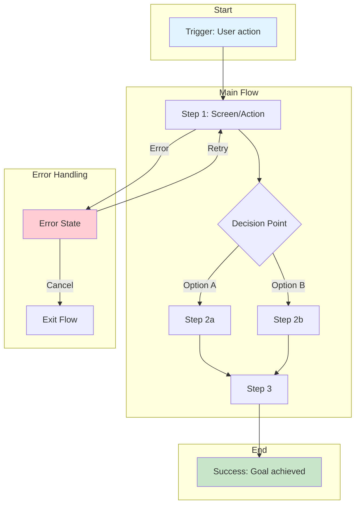

# User Flow: [FLOW_NAME]

> User journey flow for [PROJECT_NAME]

---

## Metadata

```yaml
id: UF-[XXX]
project: "[PROJECT_NAME]"
flow_name: "[Flow Name]"
version: "1.0"
created: "YYYY-MM-DD"
author: "[NAME]"
status: "Draft"
```

---

## 1. Overview

| Attribute | Value |
|-----------|-------|
| **Flow Name** | [Name] |
| **Primary Persona** | PER-XXX: [Persona Name] |
| **Goal** | [What user wants to achieve] |
| **Trigger** | [What initiates this flow] |
| **Success Outcome** | [End state when successful] |

---

## 2. Flow Diagram



---

## 3. Flow Steps

### Step 1: [Step Name]
| Attribute | Value |
|-----------|-------|
| **Screen** | SCR-XXX: [Screen Name] |
| **User Action** | [What user does] |
| **System Response** | [What system does] |
| **Next Step** | Step 2 or Decision |

### Step 2: [Step Name]
| Attribute | Value |
|-----------|-------|
| **Screen** | SCR-YYY: [Screen Name] |
| **User Action** | [What user does] |
| **System Response** | [What system does] |
| **Next Step** | Step 3 |

### Step 3: [Step Name]
| Attribute | Value |
|-----------|-------|
| **Screen** | SCR-ZZZ: [Screen Name] |
| **User Action** | [What user does] |
| **System Response** | [What system does] |
| **Next Step** | Success |

---

## 4. Decision Points

### Decision 1: [Decision Name]
| Attribute | Value |
|-----------|-------|
| **Question** | [What determines the path?] |
| **Option A** | [Condition] → [Next step] |
| **Option B** | [Condition] → [Next step] |
| **Default** | [If unclear] → [Next step] |

---

## 5. Alternative Paths

### 5.1 Happy Path (Primary)
1. [Step 1] → [Step 2] → [Step 3] → Success

### 5.2 Alternative Path A
**Trigger:** [When this path is taken]
1. [Step 1] → [Alternative step] → Success

### 5.3 Alternative Path B
**Trigger:** [When this path is taken]
1. [Different sequence]

---

## 6. Error Handling

### Error 1: [Error Type]
| Attribute | Value |
|-----------|-------|
| **Trigger** | [What causes this error] |
| **Screen** | [Where error appears] |
| **Message** | "[Error message shown]" |
| **Recovery Options** | [Retry / Edit / Cancel] |

### Error 2: [Error Type]
| Attribute | Value |
|-----------|-------|
| **Trigger** | [What causes this error] |
| **Screen** | [Where error appears] |
| **Message** | "[Error message shown]" |
| **Recovery Options** | [Retry / Edit / Cancel] |

---

## 7. Edge Cases

| Edge Case | Behavior |
|-----------|----------|
| [User is offline] | [Show cached data / offline message] |
| [Session expired] | [Redirect to login, preserve state] |
| [Incomplete data] | [Show partial view with prompt] |
| [Concurrent edit] | [Conflict resolution] |

---

## 8. Metrics & Analytics

### 8.1 Key Events to Track
| Event | Trigger | Properties |
|-------|---------|------------|
| `flow_started` | Flow begins | `flow_id`, `user_id` |
| `step_completed` | Each step done | `step_name`, `duration` |
| `flow_completed` | Success | `total_duration` |
| `flow_abandoned` | User exits | `exit_step`, `reason` |
| `error_occurred` | Error happens | `error_type`, `step` |

### 8.2 Success Metrics
| Metric | Target | Current |
|--------|--------|---------|
| Completion rate | > [X]% | [Y]% |
| Average duration | < [X]s | [Y]s |
| Error rate | < [X]% | [Y]% |
| Drop-off at [step] | < [X]% | [Y]% |

---

## 9. Related Artifacts

### 9.1 Requirements
| ID | Title | Status |
|----|-------|--------|
| FR-XXX | [Requirement] | Implemented |
| FR-YYY | [Requirement] | Implemented |

### 9.2 Screens
| ID | Screen | Role in Flow |
|----|--------|--------------|
| SCR-XXX | [Screen name] | Step 1 |
| SCR-YYY | [Screen name] | Step 2 |
| SCR-ZZZ | [Screen name] | Step 3 |

### 9.3 Test Cases
| ID | Test | Coverage |
|----|------|----------|
| TC-XXX | Happy path test | Main flow |
| TC-YYY | Error handling test | Error paths |

---

## 10. Design Notes

### 10.1 UX Considerations
- [Important UX decision or rationale]
- [Accessibility consideration]
- [Performance consideration]

### 10.2 Open Questions
- [ ] [Question needing resolution]
- [ ] [Question needing resolution]

---

## Document History

| Version | Date | Author | Changes |
|---------|------|--------|---------|
| 1.0 | YYYY-MM-DD | [Name] | Initial flow |

---

*Template follows ISO/IEC 29110-5-1-2 Software Design requirements.*
