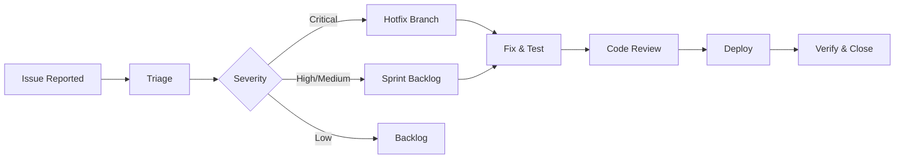

# Maintenance Guide

> ISO/IEC 29110-5-1-2 Work Product: Maintenance Documentation

---

## Metadata

```yaml
project: "[PROJECT_NAME]"
version: "1.0"
last_updated: "YYYY-MM-DD"
author: "[NAME]"
status: "Draft"
```

---

## 1. Introduction

### 1.1 Purpose
This guide provides procedures for maintaining [PROJECT_NAME] after deployment, including corrective, adaptive, and perfective maintenance activities.

### 1.2 Scope
| Maintenance Type | Description | Examples |
|------------------|-------------|----------|
| Corrective | Bug fixes | Defect resolution |
| Adaptive | Environment changes | OS upgrades, dependency updates |
| Perfective | Improvements | Performance optimization |
| Preventive | Proactive maintenance | Security patches |

---

## 2. Maintenance Procedures

### 2.1 Bug Fix Process



**Steps:**
1. Issue reported in [Issue Tracker]
2. Triage and assign severity
3. Create fix branch
4. Develop and test fix
5. Code review
6. Deploy to staging
7. Test in staging
8. Deploy to production
9. Verify and close issue

### 2.2 Dependency Updates

**Monthly Update Procedure:**
```bash
# 1. Check for updates
npm outdated  # or pip list --outdated

# 2. Review changelogs for breaking changes

# 3. Update in development
npm update  # or pip install --upgrade

# 4. Run full test suite
npm test

# 5. Deploy to staging
# 6. Test in staging
# 7. Deploy to production
```

**Security Patches:**
- Apply immediately for critical vulnerabilities
- Use `npm audit` or `pip-audit` to check

### 2.3 Database Maintenance

**Regular Tasks:**
| Task | Frequency | Command |
|------|-----------|---------|
| VACUUM | Weekly | `VACUUM ANALYZE;` |
| REINDEX | Monthly | `REINDEX DATABASE [db];` |
| Analyze | Weekly | `ANALYZE;` |
| Backup verification | Daily | Check backup logs |

**Performance Monitoring:**
```sql
-- Check slow queries
SELECT * FROM pg_stat_statements
ORDER BY total_time DESC
LIMIT 10;

-- Check table sizes
SELECT relname, pg_size_pretty(pg_total_relation_size(relid))
FROM pg_catalog.pg_statio_user_tables
ORDER BY pg_total_relation_size(relid) DESC;
```

---

## 3. Change Management

### 3.1 Change Request Process
1. Submit CR via `01-planning/change-requests/CR-XXX-[name].md`
2. Impact assessment by Tech Lead
3. Approval by PM/Steering
4. Schedule change
5. Implement and test
6. Deploy
7. Verify and close CR

### 3.2 Change Categories
| Category | Approval | Lead Time |
|----------|----------|-----------|
| Standard | Pre-approved | Immediate |
| Normal | PM | 1 week |
| Emergency | On-call Lead | Immediate |

---

## 4. Monitoring & Alerts

### 4.1 Key Metrics

| Metric | Tool | Alert Threshold |
|--------|------|-----------------|
| Uptime | [Tool] | < 99.5% |
| Error Rate | [Tool] | > 1% |
| Response Time (P95) | [Tool] | > 1s |
| CPU Usage | [Tool] | > 80% |
| Memory Usage | [Tool] | > 85% |
| Disk Usage | [Tool] | > 80% |

### 4.2 Log Monitoring

**Error Log Patterns:**
| Pattern | Severity | Action |
|---------|----------|--------|
| `FATAL` | Critical | Page on-call |
| `ERROR` | High | Investigate within 1h |
| `WARN` | Medium | Review daily |

### 4.3 Health Checks

| Endpoint | Expected | Frequency |
|----------|----------|-----------|
| `/health` | 200 OK | 1 min |
| `/health/db` | 200 OK | 5 min |
| `/health/cache` | 200 OK | 5 min |

---

## 5. Backup & Recovery

### 5.1 Backup Schedule

| Data | Method | Frequency | Retention |
|------|--------|-----------|-----------|
| Database | pg_dump | Daily | 30 days |
| File Storage | S3 sync | Daily | 90 days |
| Configuration | Git | On change | Forever |
| Logs | Archive | Daily | 90 days |

### 5.2 Recovery Procedures

**Database Recovery:**
```bash
# 1. Identify backup to restore
ls -la /backups/db/

# 2. Stop application
docker-compose stop api worker

# 3. Restore database
gunzip -c backup_YYYYMMDD.sql.gz | psql -h $DB_HOST -U $DB_USER $DB_NAME

# 4. Restart application
docker-compose start api worker

# 5. Verify
curl /health
```

### 5.3 Disaster Recovery

| Scenario | RTO | RPO | Procedure |
|----------|-----|-----|-----------|
| Database failure | 1 hour | 24 hours | Restore from backup |
| Full system failure | 4 hours | 24 hours | Rebuild from IaC |
| Regional outage | 8 hours | 24 hours | Failover to DR region |

---

## 6. Security Maintenance

### 6.1 Regular Security Tasks

| Task | Frequency | Owner |
|------|-----------|-------|
| Dependency audit | Weekly | DevOps |
| Access review | Monthly | PM |
| Secret rotation | Quarterly | DevOps |
| Penetration test | Annually | Security |
| Security patches | As released | DevOps |

### 6.2 Security Incident Response

1. **Identify** - Detect and confirm incident
2. **Contain** - Limit damage
3. **Eradicate** - Remove threat
4. **Recover** - Restore services
5. **Lessons** - Post-mortem

### 6.3 Secret Rotation

| Secret | Location | Rotation |
|--------|----------|----------|
| Database password | Secrets Manager | Quarterly |
| API keys | Secrets Manager | Annually |
| JWT secret | Secrets Manager | Quarterly |
| SSL certificates | Let's Encrypt | Auto (90 days) |

---

## 7. Performance Maintenance

### 7.1 Performance Monitoring

**Key Areas:**
- API response times
- Database query performance
- Cache hit rates
- Memory/CPU usage

### 7.2 Optimization Checklist

- [ ] Database indexes optimized
- [ ] Query performance reviewed
- [ ] Caching effective
- [ ] No memory leaks
- [ ] Static assets CDN-served
- [ ] Compression enabled

### 7.3 Capacity Planning

| Metric | Current | Projected (6mo) | Action Needed |
|--------|---------|-----------------|---------------|
| Users | [X] | [Y] | [Scale if needed] |
| Storage | [X]GB | [Y]GB | [Expand if needed] |
| Requests/day | [X] | [Y] | [Scale if needed] |

---

## 8. Documentation Maintenance

### 8.1 Documentation Updates

| Event | Documentation to Update |
|-------|------------------------|
| New feature | User guide, API docs |
| Configuration change | Operation guide |
| Dependency update | Release notes |
| Bug fix | Known issues |

### 8.2 Documentation Review

- Review all docs quarterly
- Update screenshots after UI changes
- Verify procedures still work

---

## 9. Support Information

### 9.1 Support Contacts

| Level | Contact | Hours | Response |
|-------|---------|-------|----------|
| L1 | [Email/Portal] | Business hours | 4 hours |
| L2 | [Email] | Business hours | 8 hours |
| L3 | [On-call] | 24/7 | 1 hour (critical) |

### 9.2 Vendor Support

| Vendor | Product | Support Portal |
|--------|---------|----------------|
| [Cloud provider] | Infrastructure | [URL] |
| [DB vendor] | Database | [URL] |

---

## Document History

| Version | Date | Author | Changes |
|---------|------|--------|---------|
| 1.0 | YYYY-MM-DD | [Name] | Initial guide |

---

*Template follows ISO/IEC 29110-5-1-2 Maintenance Documentation requirements.*
