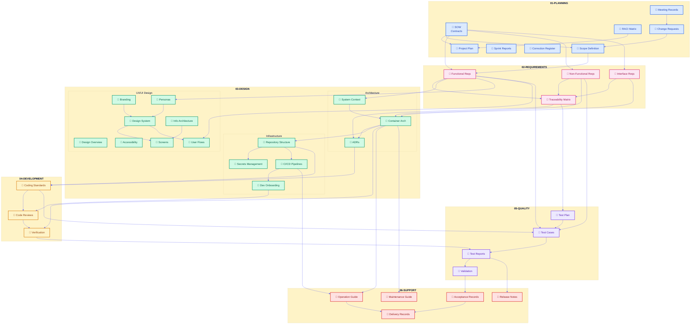
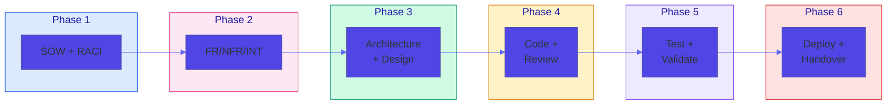
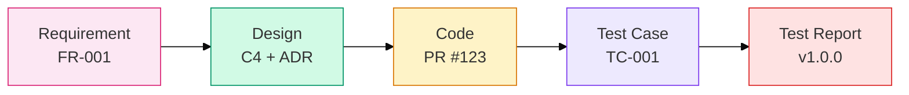

# ISO 29110-5-1-2 Standard Operating Procedure

> **Purpose**: Onboard new team members to use ISO 29110 templates effectively
> **Audience**: Project Managers, Developers, QA, Technical Writers
> **Last Updated**: 2025-11-29

---

## Table of Contents

1. [Quick Start](#quick-start)
2. [Understanding ISO 29110](#understanding-iso-29110)
3. [Document Classification](#document-classification)
4. [Dependency Graph](#dependency-graph)
5. [Phase-by-Phase Workflow](#phase-by-phase-workflow)
6. [Naming Conventions](#naming-conventions)
7. [Template Usage Guide](#template-usage-guide)
8. [Checklists](#checklists)
9. [Common Pitfalls](#common-pitfalls)
10. [AI-Assisted Workflow](#ai-assisted-workflow)

---

## Quick Start

### Your First 30 Minutes

1. **Read this SOP** - Understand the overall structure
2. **Review `README.md`** - Understand template philosophy
3. **Check `version.json`** - Know current template version
4. **Explore folder structure** - Each phase has its own directory

### Folder Structure Overview

```
iso-29110/
├── 00-assets/          # Images, diagrams, media
├── 01-planning/        # SOW, Project Plans, RACI
├── 02-requirements/    # FR, NFR, INT, Traceability
├── 03-design/          # Architecture, UX/UI, Infrastructure
├── 04-development/     # Coding Standards, Reviews
├── 05-quality/         # Test Plans, Cases, Reports
├── 06-support/         # Operations, Maintenance, Delivery
├── README.md           # Template overview
├── SOP.md              # This file (Standard Operating Procedure)
└── version.json        # Template versioning
```

---

## Understanding ISO 29110

### What is ISO 29110?

ISO/IEC 29110-5-1-2 is an international standard for **Very Small Entities (VSEs)** - organizations with fewer than 25 people. It provides a lightweight but comprehensive framework for software development lifecycle management.

### Why Use These Templates?

| Benefit | Description |
|---------|-------------|
| **Traceability** | Link requirements → design → code → tests |
| **Compliance** | Meet ISO certification requirements |
| **Consistency** | Standardized documents across projects |
| **Knowledge Transfer** | New members onboard quickly |
| **Risk Reduction** | Structured change control |

### Core Principles

1. **Everything is documented** - No undocumented decisions
2. **Traceability is king** - Every requirement maps to tests
3. **Change is controlled** - All scope changes go through CR process
4. **Quality is built-in** - Reviews at every phase gate

---

## Document Classification

### Three Document Types

| Type | Symbol | Description | Example |
|------|--------|-------------|---------|
| **Single** | 📄 | One per project, updated over time | `test-plan.md` |
| **Iteration** | 📅 | One per occurrence (dated/versioned) | `sprint-29Nov2025.md` |
| **Split** | 📂 | One per item (ID-prefixed) | `FR-001-user-login.md` |

### Document Status Lifecycle

```
Draft → In Review → Approved → [Deprecated]
```

### Metadata (YAML Frontmatter)

Every document MUST include:

```yaml
---
id: "FR-001"
title: "User Login Feature"
version: "1.0.0"
status: "Draft"           # Draft | In Review | Approved | Deprecated
phase: 1                   # Which contract phase
contract_ref: "SOW-phase1-29Nov2025"
created_date: "2025-11-29"
last_updated: "2025-11-29"
author: "github-username"
approver: "approver-username"
upstream_refs:             # What this depends on
  - "SOW-phase1-29Nov2025"
downstream_refs:           # What depends on this
  - "TC-001-login-test"
---
```

---

## Dependency Graph

### High-Level Document Flow



### Simplified Linear Flow



### Traceability Chain



---

## Phase-by-Phase Workflow

### Phase 1: Planning (01-planning/)

**Objective**: Establish project foundation and governance

| Order | Document | When to Create | Owner |
|-------|----------|----------------|-------|
| 1 | Meeting Records | Kickoff meeting | PM |
| 2 | RACI Matrix | Before project starts | PM |
| 3 | SOW (Contracts) | Contract signing | PM/Sales |
| 4 | Project Plan | After SOW approved | PM |
| 5 | Scope Definition | With Project Plan | PM |
| 6 | Sprint Reports | Every 2 weeks | PM |
| 7 | Change Requests | As needed | Anyone |
| 8 | Correction Register | When defects found | QA |

**Exit Criteria**:
- [ ] SOW signed by client
- [ ] Project Plan approved
- [ ] RACI documented and communicated
- [ ] Scope baseline established

---

### Phase 2: Requirements (02-requirements/)

**Objective**: Define what the system must do

| Order | Document | When to Create | Owner |
|-------|----------|----------------|-------|
| 1 | Functional Requirements (FR) | During analysis | BA/PM |
| 2 | Non-Functional Requirements (NFR) | With FR | Tech Lead |
| 3 | Interface Requirements (INT) | With FR | Tech Lead |
| 4 | Traceability Matrix | After all reqs | PM |

**Exit Criteria**:
- [ ] All requirements have acceptance criteria
- [ ] Client approved requirements
- [ ] Traceability matrix complete
- [ ] No TBD/TBC items remaining

---

### Phase 3: Design (03-design/)

**Objective**: Design the solution architecture and user experience

| Order | Document | When to Create | Owner |
|-------|----------|----------------|-------|
| 1 | System Context (C4 L1) | Start of design | Architect |
| 2 | Container Architecture (C4 L2) | After L1 | Architect |
| 3 | ADRs | For each decision | Tech Lead |
| 4 | Repository Structure | Before coding | Tech Lead |
| 5 | Secrets Management | With repo setup | DevOps |
| 6 | CI/CD Pipelines | With repo setup | DevOps |
| 7 | Personas | With UX design | UX Designer |
| 8 | Design System | Before screens | UX Designer |
| 9 | User Flows | With personas | UX Designer |
| 10 | Screens/Mockups | After design system | UX Designer |
| 11 | Developer Onboarding | Before dev starts | Tech Lead |

**Exit Criteria**:
- [ ] Architecture reviewed and approved
- [ ] ADRs document all key decisions
- [ ] Design system published
- [ ] Repository and CI/CD ready
- [ ] Dev onboarding guide complete

---

### Phase 4: Development (04-development/)

**Objective**: Build the solution with quality

| Order | Document | When to Create | Owner |
|-------|----------|----------------|-------|
| 1 | Coding Standards | Before coding starts | Tech Lead |
| 2 | Code Review Records | Every PR | Reviewers |
| 3 | Verification Records | Phase completion | Tech Lead |

**Exit Criteria**:
- [ ] All features coded per requirements
- [ ] All code reviewed and approved
- [ ] Verification sign-off obtained
- [ ] No critical code quality issues

---

### Phase 5: Quality (05-quality/)

**Objective**: Verify and validate the solution

| Order | Document | When to Create | Owner |
|-------|----------|----------------|-------|
| 1 | Test Plan | Before testing | QA Lead |
| 2 | Test Cases | Per requirement | QA |
| 3 | Test Reports | After execution | QA |
| 4 | Validation Records | UAT completion | QA/PM |

**Exit Criteria**:
- [ ] All test cases executed
- [ ] Coverage targets met (>80%)
- [ ] No critical/major defects open
- [ ] UAT sign-off obtained

---

### Phase 6: Support (06-support/)

**Objective**: Deploy, handover, and support

| Order | Document | When to Create | Owner |
|-------|----------|----------------|-------|
| 1 | Operation Guide | Before deployment | DevOps |
| 2 | Maintenance Guide | Before handover | Tech Lead |
| 3 | Release Notes | Each release | PM |
| 4 | Acceptance Records | Client sign-off | PM |
| 5 | Delivery Records | Final handover | PM |

**Exit Criteria**:
- [ ] System deployed to production
- [ ] Operations team trained
- [ ] Client acceptance signed
- [ ] All deliverables handed over

---

## Naming Conventions

### File Naming Patterns

| Document Type | Pattern | Example |
|---------------|---------|---------|
| Contracts/SOW | `SOW-phase{N}-{DATE}.md` | `SOW-phase1-29Nov2025.md` |
| Project Plans | `plan-phase{N}-{NAME}.md` | `plan-phase1-mvp.md` |
| Scope Definitions | `scope-phase{N}-{TYPE}.md` | `scope-phase1-baseline.md` |
| Meeting Records | `{YYYY-MM-DD}.md` | `2025-11-29.md` |
| Sprint Reports | `sprint-{DATE}.md` | `sprint-29Nov2025.md` |
| Change Requests | `CR-{XXX}-{name}.md` | `CR-001-add-payment.md` |
| Functional Reqs | `FR-{XXX}-{name}.md` | `FR-001-user-login.md` |
| Non-Functional Reqs | `NFR-{XXX}-{name}.md` | `NFR-001-performance.md` |
| Interface Reqs | `INT-{XXX}-{name}.md` | `INT-001-stripe-api.md` |
| ADRs | `ADR-{XXX}-{name}.md` | `ADR-001-use-react.md` |
| Personas | `PER-{XXX}-{name}.md` | `PER-001-admin-user.md` |
| Screens | `SCR-{XXX}-{name}.md` | `SCR-001-login-page.md` |
| User Flows | `UF-{XXX}-{name}.md` | `UF-001-checkout-flow.md` |
| Test Cases | `TC-{XXX}-{name}.md` | `TC-001-login-flow.md` |
| Test Reports | `test-report-v{VERSION}.md` | `test-report-v1.0.0.md` |
| Verification | `verification-v{VERSION}.md` | `verification-v1.0.0.md` |
| Validation | `validation-v{VERSION}.md` | `validation-v1.0.0.md` |
| Acceptance | `acceptance-{MILESTONE}.md` | `acceptance-phase1.md` |
| Delivery | `delivery-v{VERSION}.md` | `delivery-v1.0.0.md` |
| Release Notes | `v{VERSION}.md` | `v1.0.0.md` |

### ID Numbering Rules

- Start from `001` for each document type
- Increment sequentially: `001`, `002`, `003`...
- Never reuse IDs (even if document deleted)
- Use leading zeros for sorting: `001` not `1`

---

## Template Usage Guide

### How to Use a Template

1. **Copy the template file** (e.g., `_template.md`)
2. **Rename following naming convention** (e.g., `FR-001-user-login.md`)
3. **Fill in YAML frontmatter** with correct metadata
4. **Complete all sections** (remove N/A sections or mark explicitly)
5. **Add to traceability matrix** if applicable
6. **Submit for review** per RACI matrix

### Template File Structure

Each folder contains:
- `README.md` - Folder-specific guidelines
- `_template.md` - Template to copy (if Split type)
- Example files showing proper usage

### Multi-Phase Projects

When a project spans multiple contracts/phases:

1. Use `phase: N` in frontmatter
2. Reference correct SOW: `contract_ref: "SOW-phase2-..."`
3. Update traceability matrix with phase info
4. Keep all phase documents in same folders

---

## Checklists

### New Project Checklist

- [ ] Create project folder structure from templates
- [ ] Assign RACI for all document types
- [ ] Complete SOW and get signatures
- [ ] Create Project Plan with milestones
- [ ] Establish baseline scope
- [ ] Set up traceability matrix
- [ ] Configure version control

### Document Review Checklist

- [ ] YAML frontmatter complete and accurate
- [ ] All required sections filled
- [ ] References to other docs correct
- [ ] Status updated appropriately
- [ ] Version incremented if applicable
- [ ] Approver assigned

### Phase Gate Checklist

Use exit criteria from [Phase-by-Phase Workflow](#phase-by-phase-workflow) section.

---

## Common Pitfalls

### What to Avoid

| Pitfall | Why It's Bad | How to Avoid |
|---------|--------------|--------------|
| **Incomplete traceability** | Can't prove coverage | Update matrix with every req/test |
| **Scope creep** | Budget/timeline overrun | All changes through CR process |
| **Missing metadata** | Can't track/search docs | Always fill YAML frontmatter |
| **Orphaned documents** | Inconsistent state | Update related docs together |
| **Vague requirements** | Untestable features | Every req needs acceptance criteria |
| **Undocumented decisions** | Lost knowledge | Create ADR for every decision |
| **Skipping reviews** | Quality issues | Follow RACI for all approvals |
| **Assumption ambiguity** | Misunderstandings | Document all assumptions explicitly |

### Red Flags to Watch For

- Requirements without acceptance criteria
- Design without corresponding ADRs
- Code without tests
- Tests without traceability to requirements
- Changes without Change Requests
- Approvals without signatures/dates

---

## AI-Assisted Workflow

### Using AI to Generate Documents

1. **AI reads `_template.md`** - Understands structure
2. **AI generates document** - Based on context/input
3. **Human reviews** - Validates accuracy
4. **Human approves** - Updates status
5. **Git commits** - Version controlled

### Best Practices

- Always review AI-generated content
- Verify all cross-references
- Ensure domain-specific accuracy
- Check for consistency with existing docs

### Claude Code Integration

When using Claude Code with these templates:

```bash
# Generate a new requirement
"Create FR-015 for user password reset feature based on the template"

# Update traceability
"Add FR-015 to the traceability matrix and link to TC-015"

# Generate test cases
"Create test cases for FR-015 following the test case template"
```

---

## Quick Reference Card

### Document Types at a Glance

| Phase | Single (📄) | Iteration (📅) | Split (📂) |
|-------|-------------|----------------|------------|
| **Planning** | RACI, Correction Register | SOW, Plan, Scope, Meetings, Sprints | Change Requests |
| **Requirements** | Traceability Matrix | - | FR, NFR, INT |
| **Design** | C4, Repo, Secrets, CI/CD, Design System, Branding, IA, A11Y | - | ADRs, Personas, Screens, Flows |
| **Development** | Coding Standards | Reviews, Verification | - |
| **Quality** | Test Plan | Test Reports, Validation | Test Cases |
| **Support** | Ops Guide, Maintenance Guide | Acceptance, Delivery, Releases | - |

### Key Contacts

| Role | Responsibility |
|------|----------------|
| Project Manager | Planning, tracking, client communication |
| Tech Lead | Architecture, coding standards, reviews |
| Business Analyst | Requirements analysis |
| UX Designer | Design system, screens, flows |
| QA Lead | Test strategy, quality assurance |
| DevOps | CI/CD, infrastructure, deployment |

---

## Version History

| Version | Date | Author | Changes |
|---------|------|--------|---------|
| 1.0.0 | 2025-11-29 | Auto-generated | Initial SOP creation |

---

> **Need Help?** Contact your Project Manager or Tech Lead for guidance on using these templates.
