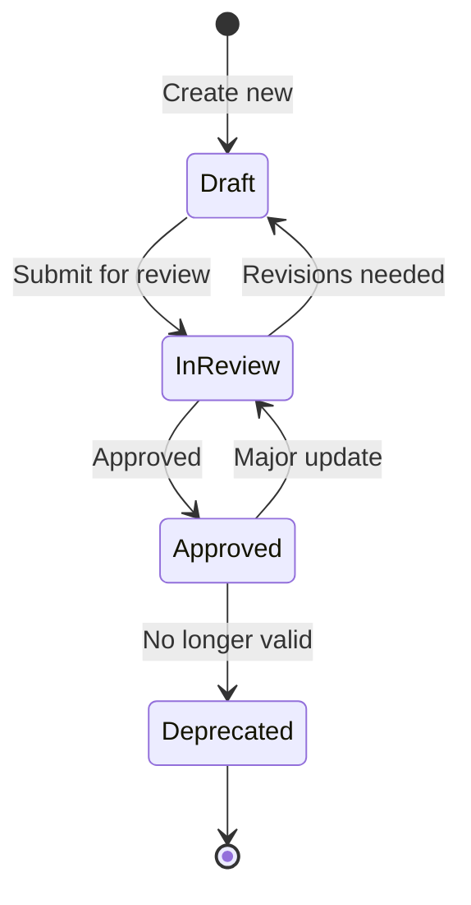

# ISO 29110-5-1-2 Work Instructions

> **Purpose**: Step-by-step procedures for creating and maintaining ISO 29110 documents
> **Prerequisite**: Read [SOP.md](SOP.md) first to understand document types and workflow
> **Last Updated**: 2025-11-29

---

## Table of Contents

1. [How to Use This Guide](#how-to-use-this-guide)
2. [General Procedures](#general-procedures)
3. [Phase 1: Planning Documents](#phase-1-planning-documents)
4. [Phase 2: Requirements Documents](#phase-2-requirements-documents)
5. [Phase 3: Design Documents](#phase-3-design-documents)
6. [Phase 4: Development Documents](#phase-4-development-documents)
7. [Phase 5: Quality Documents](#phase-5-quality-documents)
8. [Phase 6: Support Documents](#phase-6-support-documents)
9. [Cross-Cutting Procedures](#cross-cutting-procedures)

---

## How to Use This Guide

### Document Structure

Each work instruction follows this format:

```
📋 [Document Name]
├── Purpose: Why this document exists
├── When to Create: Trigger conditions
├── Prerequisites: What you need before starting
├── Step-by-Step Procedure: Detailed instructions
├── Quality Checklist: Verification points
└── Common Mistakes: What to avoid
```

### Symbols Used

| Symbol | Meaning |
|--------|---------|
| ✅ | Required step |
| ⚠️ | Important warning |
| 💡 | Helpful tip |
| 🔗 | Cross-reference to another document |

---

## General Procedures

### WI-GEN-001: Creating Any New Document

**Purpose**: Standard procedure for creating any ISO 29110 document

**Step-by-Step Procedure**:

1. ✅ **Identify document type**
   - Check [SOP.md](SOP.md) for document classification
   - Determine if Single (📄), Iteration (📅), or Split (📂)

2. ✅ **Navigate to correct folder**
   ```bash
   cd 02-declared-intent/templates/iso-29110/{phase-folder}/
   ```

3. ✅ **Copy the template**
   ```bash
   # For Split documents
   cp _template.md {ID}-{name}.md

   # For Iteration documents
   cp _template.md {dated-name}.md
   ```

4. ✅ **Fill YAML frontmatter**
   ```yaml
   ---
   id: "UNIQUE-ID"
   title: "Descriptive Title"
   version: "1.0.0"
   status: "Draft"
   phase: 1
   contract_ref: "SOW-phase1-DDMMMYYYY"
   created_date: "YYYY-MM-DD"
   last_updated: "YYYY-MM-DD"
   author: "your-github-username"
   approver: "approver-github-username"
   upstream_refs:
     - "PARENT-DOC-ID"
   downstream_refs: []
   ---
   ```

5. ✅ **Complete all sections**
   - Fill every section in the template
   - Mark sections as "N/A" if not applicable (don't delete)
   - Remove placeholder text

6. ✅ **Add cross-references**
   - Link to upstream documents (what this depends on)
   - Update downstream documents (what depends on this)

7. ✅ **Self-review**
   - Check spelling and grammar
   - Verify all links work
   - Ensure consistency with related documents

8. ✅ **Submit for review**
   - Create PR or send for review per RACI
   - Update status to "In Review"

9. ✅ **After approval**
   - Update status to "Approved"
   - Update `last_updated` date
   - Add approver signature/date

**Quality Checklist**:
- [ ] Frontmatter complete
- [ ] All sections filled
- [ ] Cross-references correct
- [ ] No placeholder text remaining
- [ ] Follows naming convention

---

### WI-GEN-002: Updating an Existing Document

**Purpose**: Standard procedure for modifying approved documents

**Step-by-Step Procedure**:

1. ✅ **Check current status**
   - Only "Approved" documents need formal update process
   - "Draft" documents can be edited directly

2. ✅ **Determine change type**
   | Change Type | Action |
   |-------------|--------|
   | Typo/formatting | Direct edit, increment patch version |
   | Content update | Create Change Request if scope-affecting |
   | Major revision | Increment minor/major version |

3. ✅ **Create working copy** (for major changes)
   ```bash
   # Keep original, work on copy
   cp document.md document-v2-draft.md
   ```

4. ✅ **Update version number**
   ```yaml
   version: "1.0.0"  # Before
   version: "1.1.0"  # After (minor change)
   version: "2.0.0"  # After (major change)
   ```

5. ✅ **Update metadata**
   ```yaml
   last_updated: "YYYY-MM-DD"
   status: "In Review"
   ```

6. ✅ **Document changes**
   - Add entry to version history section
   - Describe what changed and why

7. ✅ **Update related documents**
   - Check downstream_refs for affected documents
   - Update traceability matrix if applicable

8. ✅ **Submit for re-approval**
   - Follow same approval process as new documents

**Quality Checklist**:
- [ ] Version incremented correctly
- [ ] Change documented in version history
- [ ] Related documents updated
- [ ] Traceability maintained

---

### WI-GEN-003: Managing Document Status

**Purpose**: Properly transition documents through status lifecycle

**Status Workflow**:



**Procedure for Each Transition**:

| From | To | Who | Action |
|------|-----|-----|--------|
| - | Draft | Author | Create document |
| Draft | In Review | Author | Submit PR/request review |
| In Review | Draft | Reviewer | Request changes |
| In Review | Approved | Approver | Sign off with date |
| Approved | In Review | Author | Start major update |
| Approved | Deprecated | PM | Document superseded/obsolete |

---

## Phase 1: Planning Documents

### WI-PLN-001: Creating Statement of Work (SOW)

**Purpose**: Establish legally binding project agreement

**When to Create**: Before project kickoff, after initial client discussions

**Prerequisites**:
- Client requirements gathered
- Initial scope discussed
- Budget parameters known
- RACI matrix defined

**Step-by-Step Procedure**:

1. ✅ **Copy template**
   ```bash
   cd 01-planning/contracts/
   cp _template.md SOW-phase1-$(date +%d%b%Y).md
   ```

2. ✅ **Fill contract header**
   ```markdown
   ## Contract Information
   - Contract Number: C-{YEAR}-{SEQ}
   - Client: {Legal Entity Name}
   - Effective Date: {Start Date}
   - End Date: {End Date}
   ```

3. ✅ **Define scope**
   - List all deliverables explicitly
   - Define what is OUT of scope
   - Reference requirements if available

4. ✅ **Set timeline**
   - Define milestones with dates
   - Include review/approval periods
   - Add buffer for contingencies (10-20%)

5. ✅ **Specify budget**
   - Total contract value
   - Payment schedule
   - Change order rates

6. ✅ **Define acceptance criteria**
   - How deliverables will be accepted
   - Review periods
   - Sign-off process

7. ✅ **Add terms and conditions**
   - Use standard T&C template
   - Customize as needed
   - Include SLA references 🔗 `support-sla.md`

8. ✅ **Legal review**
   - Submit to legal for review
   - Incorporate feedback

9. ✅ **Client review and signature**
   - Send to client
   - Track signature dates
   - Store signed copy

**Quality Checklist**:
- [ ] All deliverables listed
- [ ] Out of scope clearly defined
- [ ] Timeline is realistic
- [ ] Budget matches proposal
- [ ] Acceptance criteria testable
- [ ] Legal approved
- [ ] Both parties signed

**Common Mistakes**:
- ⚠️ Vague deliverable descriptions
- ⚠️ Missing out-of-scope section
- ⚠️ Unrealistic timelines
- ⚠️ No change control process defined

---

### WI-PLN-002: Creating RACI Matrix

**Purpose**: Define roles and responsibilities for all project activities

**When to Create**: Before project kickoff, after team assignment

**Prerequisites**:
- Team members identified
- Project activities known
- Stakeholders identified

**Step-by-Step Procedure**:

1. ✅ **Copy template**
   ```bash
   cd 01-planning/
   cp raci-matrix/_template.md raci-matrix.md
   ```

2. ✅ **List all activities**
   - Group by phase
   - Be specific (not "Development" but "Backend API Development")

3. ✅ **Identify all roles**
   - Project Manager
   - Tech Lead
   - Developers
   - QA
   - Client stakeholders
   - Other relevant roles

4. ✅ **Assign RACI for each activity**
   | Letter | Meaning | Rule |
   |--------|---------|------|
   | **R** | Responsible | Does the work. Can be multiple. |
   | **A** | Accountable | Final authority. **Only ONE per activity.** |
   | **C** | Consulted | Provides input. Two-way communication. |
   | **I** | Informed | Kept updated. One-way communication. |

5. ✅ **Validate assignments**
   - Every activity has exactly ONE "A"
   - Every activity has at least ONE "R"
   - No role has too many "A"s (bottleneck)

6. ✅ **Review with team**
   - Share with all team members
   - Get acknowledgment
   - Resolve conflicts

7. ✅ **Communicate to stakeholders**
   - Share with client
   - Post in project documentation

**Example RACI Matrix**:

| Activity | PM | Tech Lead | Dev | QA | Client |
|----------|-----|-----------|-----|-----|--------|
| SOW Creation | A,R | C | I | I | C |
| Requirements Analysis | A | R | C | C | R |
| Architecture Design | C | A,R | R | C | I |
| Code Development | I | A | R | C | I |
| Testing | C | C | C | A,R | I |
| Deployment | A | R | R | C | I |
| Acceptance | R | C | I | I | A |

**Quality Checklist**:
- [ ] All activities covered
- [ ] Exactly one "A" per activity
- [ ] At least one "R" per activity
- [ ] No role overloaded
- [ ] Team reviewed and agreed
- [ ] Client stakeholders included

**Common Mistakes**:
- ⚠️ Multiple "A"s for same activity (no clear accountability)
- ⚠️ Missing activities
- ⚠️ Not updating when team changes
- ⚠️ Client not included for relevant activities

---

### WI-PLN-003: Creating Project Plan

**Purpose**: Detail how the project will be executed

**When to Create**: After SOW signed, before work begins

**Prerequisites**:
- SOW approved 🔗
- RACI defined 🔗
- Team assigned
- Tools/infrastructure ready

**Step-by-Step Procedure**:

1. ✅ **Copy template**
   ```bash
   cd 01-planning/plans/
   cp _template.md plan-phase1-$(echo $PROJECT_NAME | tr '[:upper:]' '[:lower:]').md
   ```

2. ✅ **Define Work Breakdown Structure (WBS)**
   ```markdown
   ## Work Breakdown Structure

   ### 1.0 Project Management
   - 1.1 Kickoff meeting
   - 1.2 Weekly status meetings
   - 1.3 Sprint planning

   ### 2.0 Requirements
   - 2.1 Stakeholder interviews
   - 2.2 Requirements documentation
   - 2.3 Requirements review

   ### 3.0 Design
   ...
   ```

3. ✅ **Create schedule**
   - Assign dates to each WBS item
   - Identify dependencies
   - Mark milestones

4. ✅ **Estimate effort**
   - Hours per task
   - Resources assigned
   - 💡 Use historical data if available

5. ✅ **Identify risks**
   | Risk | Probability | Impact | Mitigation |
   |------|-------------|--------|------------|
   | Key resource leaves | Medium | High | Cross-training |
   | Scope creep | High | Medium | Strict CR process |

6. ✅ **Define communication plan**
   - Status reporting frequency
   - Escalation paths
   - Meeting schedule

7. ✅ **Set quality gates**
   - Phase exit criteria
   - Review checkpoints
   - Approval requirements

8. ✅ **Get approval**
   - PM approves
   - Client acknowledges

**Quality Checklist**:
- [ ] WBS complete and detailed
- [ ] Schedule is realistic
- [ ] Dependencies identified
- [ ] Risks documented with mitigations
- [ ] Communication plan defined
- [ ] Quality gates specified

---

### WI-PLN-004: Creating Change Request

**Purpose**: Formally propose and track scope/schedule/budget changes

**When to Create**:
- Client requests new feature
- Technical issue requires scope change
- Schedule needs adjustment
- Budget impact identified

**Prerequisites**:
- Baseline scope exists 🔗
- Change clearly identified
- Impact analyzed

**Step-by-Step Procedure**:

1. ✅ **Copy template**
   ```bash
   cd 01-planning/change-requests/
   # Get next CR number
   NEXT_CR=$(ls CR-*.md 2>/dev/null | wc -l | xargs -I {} expr {} + 1)
   cp _template.md CR-$(printf "%03d" $NEXT_CR)-{change-name}.md
   ```

2. ✅ **Fill request header**
   ```yaml
   id: "CR-001"
   title: "Add Payment Gateway Integration"
   requested_by: "client-name"
   request_date: "2025-11-29"
   priority: "High"  # Critical | High | Medium | Low
   type: "Scope"     # Scope | Schedule | Budget | Technical
   ```

3. ✅ **Describe the change**
   ```markdown
   ## Change Description

   ### Current State
   [What exists now]

   ### Proposed Change
   [What should change]

   ### Reason for Change
   [Why is this needed]
   ```

4. ✅ **Analyze impact**
   ```markdown
   ## Impact Analysis

   ### Scope Impact
   - [ ] New requirements needed: Yes/No
   - [ ] Existing requirements affected: [List]

   ### Schedule Impact
   - Additional effort: X hours/days
   - Delivery date change: From [date] to [date]

   ### Budget Impact
   - Additional cost: $X
   - Justification: [Details]

   ### Technical Impact
   - Architecture changes: [Details]
   - Risk assessment: [Details]
   ```

5. ✅ **Define implementation plan**
   - Tasks required
   - Timeline
   - Resources needed

6. ✅ **Get approvals**
   ```markdown
   ## Approvals

   | Role | Name | Decision | Date |
   |------|------|----------|------|
   | Tech Lead | @username | Approved | 2025-11-29 |
   | PM | @username | Approved | 2025-11-29 |
   | Client | @client | Pending | - |
   ```

7. ✅ **Update related documents**
   - Update scope baseline
   - Update project plan
   - Update requirements if needed
   - Update traceability matrix

**Quality Checklist**:
- [ ] Change clearly described
- [ ] All impacts analyzed
- [ ] Implementation plan defined
- [ ] All approvals obtained
- [ ] Related documents updated

**Common Mistakes**:
- ⚠️ Implementing before approval
- ⚠️ Incomplete impact analysis
- ⚠️ Not updating baseline documents
- ⚠️ Missing client approval for scope changes

---

### WI-PLN-005: Creating Sprint Report

**Purpose**: Track sprint progress, velocity, and retrospective findings

**When to Create**: End of each 2-week sprint

**Prerequisites**:
- Sprint completed
- All issues updated in GitHub
- Team retrospective held

**Step-by-Step Procedure**:

1. ✅ **Copy template**
   ```bash
   cd 01-planning/progress/
   cp _template.md sprint-$(date +%d%b%Y).md
   ```

2. ✅ **Fill sprint header**
   ```yaml
   sprint_number: 5
   start_date: "2025-11-15"
   end_date: "2025-11-29"
   team_capacity_hours: 160
   ```

3. ✅ **Summarize completed work**
   ```markdown
   ## Completed Items

   | Issue | Title | Estimate | Actual | Assignee |
   |-------|-------|----------|--------|----------|
   | #123 | User login | 8h | 10h | @dev1 |
   | #124 | Password reset | 4h | 3h | @dev2 |
   ```

4. ✅ **Document incomplete work**
   ```markdown
   ## Incomplete/Carried Over

   | Issue | Title | Reason | Action |
   |-------|-------|--------|--------|
   | #125 | OAuth | Blocked by vendor | Escalate |
   ```

5. ✅ **Calculate metrics**
   ```markdown
   ## Metrics

   - Planned: 40 hours
   - Completed: 35 hours
   - Velocity: 87.5%
   - Carry-over: 5 hours
   ```

6. ✅ **Retrospective findings**
   ```markdown
   ## Retrospective

   ### What Went Well
   - Daily standups were effective
   - Code reviews caught issues early

   ### What Needs Improvement
   - Estimation accuracy
   - Documentation updates

   ### Action Items
   - [ ] Add estimation buffer (owner: PM)
   - [ ] Update docs before PR merge (owner: Tech Lead)
   ```

7. ✅ **Update burndown/velocity charts**
   - Add to project tracking tool
   - Update trend analysis

**Quality Checklist**:
- [ ] All completed work documented
- [ ] Incomplete work explained
- [ ] Metrics calculated correctly
- [ ] Retrospective actionable
- [ ] Action items assigned

---

## Phase 2: Requirements Documents

### WI-REQ-001: Creating Functional Requirement

**Purpose**: Define a specific feature or capability the system must provide

**When to Create**: During requirements analysis phase

**Prerequisites**:
- SOW/scope defined 🔗
- Stakeholder input gathered
- User stories available (if applicable)

**Step-by-Step Procedure**:

1. ✅ **Copy template**
   ```bash
   cd 02-requirements/functional/
   NEXT_FR=$(ls FR-*.md 2>/dev/null | wc -l | xargs -I {} expr {} + 1)
   cp _template.md FR-$(printf "%03d" $NEXT_FR)-{feature-name}.md
   ```

2. ✅ **Fill requirement header**
   ```yaml
   id: "FR-001"
   title: "User Login with Email/Password"
   priority: "Must Have"  # Must Have | Should Have | Could Have | Won't Have
   status: "Draft"
   phase: 1
   ```

3. ✅ **Write requirement statement**
   ```markdown
   ## Requirement

   The system SHALL allow users to log in using their email address
   and password combination.
   ```

   💡 **Use precise language**:
   - **SHALL** = Mandatory requirement
   - **SHOULD** = Recommended but not mandatory
   - **MAY** = Optional

4. ✅ **Define acceptance criteria**
   ```markdown
   ## Acceptance Criteria

   **Given** a registered user
   **When** they enter valid email and password
   **Then** they are authenticated and redirected to dashboard

   **Given** a user with invalid credentials
   **When** they attempt to log in
   **Then** they see an error message and remain on login page
   ```

5. ✅ **Specify constraints**
   ```markdown
   ## Constraints

   - Password must be masked during input
   - Maximum 5 failed attempts before lockout
   - Session timeout after 30 minutes of inactivity
   ```

6. ✅ **Add dependencies**
   ```markdown
   ## Dependencies

   - FR-002: User Registration (must exist before login)
   - NFR-001: Security Requirements
   - INT-001: OAuth Provider Integration (optional)
   ```

7. ✅ **Include UI mockup reference**
   ```markdown
   ## UI Reference

   See: [SCR-001-login-page](../03-design/ux-ui/screens/SCR-001-login-page.md)
   ```

8. ✅ **Update traceability matrix**
   - Add FR to requirements list
   - Link to future test cases
   - Link to design documents

**Quality Checklist**:
- [ ] Requirement is testable
- [ ] Acceptance criteria are specific
- [ ] Priority assigned
- [ ] Dependencies identified
- [ ] Added to traceability matrix
- [ ] No ambiguous language

**Common Mistakes**:
- ⚠️ Vague requirements ("system should be fast")
- ⚠️ Missing acceptance criteria
- ⚠️ Solution in requirement (should describe WHAT not HOW)
- ⚠️ Multiple requirements in one document

---

### WI-REQ-002: Creating Non-Functional Requirement

**Purpose**: Define quality attributes (performance, security, scalability, etc.)

**When to Create**: Alongside functional requirements

**Prerequisites**:
- System context understood
- Performance/security needs known
- Infrastructure constraints known

**Step-by-Step Procedure**:

1. ✅ **Copy template**
   ```bash
   cd 02-requirements/non-functional/
   NEXT_NFR=$(ls NFR-*.md 2>/dev/null | wc -l | xargs -I {} expr {} + 1)
   cp _template.md NFR-$(printf "%03d" $NEXT_NFR)-{quality-attribute}.md
   ```

2. ✅ **Identify NFR category**
   | Category | Examples |
   |----------|----------|
   | Performance | Response time, throughput |
   | Security | Authentication, encryption |
   | Scalability | User capacity, data volume |
   | Availability | Uptime, disaster recovery |
   | Usability | Accessibility, learnability |
   | Maintainability | Code quality, documentation |

3. ✅ **Write measurable requirement**
   ```markdown
   ## Requirement

   The system SHALL respond to API requests within 200ms
   for 95% of requests under normal load (1000 concurrent users).
   ```

   ⚠️ **NFRs MUST be measurable!**

4. ✅ **Define measurement method**
   ```markdown
   ## Measurement

   - Tool: Apache JMeter / k6
   - Test scenario: 1000 virtual users, 10-minute duration
   - Success criteria: P95 latency < 200ms
   - Measurement frequency: Every release
   ```

5. ✅ **Specify test approach**
   ```markdown
   ## Testing Approach

   - Performance testing during QA phase
   - Load testing before production release
   - Monitoring in production (Datadog/NewRelic)
   ```

6. ✅ **Update traceability matrix**

**Quality Checklist**:
- [ ] Requirement is measurable
- [ ] Units specified (ms, %, users)
- [ ] Test method defined
- [ ] Baseline/target values clear
- [ ] Added to traceability matrix

**Common Mistakes**:
- ⚠️ Unmeasurable requirements ("system should be fast")
- ⚠️ Missing units
- ⚠️ No test method defined
- ⚠️ Unrealistic targets

---

### WI-REQ-003: Updating Traceability Matrix

**Purpose**: Maintain links between requirements, design, code, and tests

**When to Update**:
- New requirement added
- New test case created
- Design document updated
- Code implementation completed

**Step-by-Step Procedure**:

1. ✅ **Open traceability matrix**
   ```bash
   cd 02-requirements/
   # Edit traceability-matrix.md
   ```

2. ✅ **Add new row for requirement**
   ```markdown
   | FR-015 | User Profile Edit | ADR-003, SCR-005 | PR #234 | TC-015, TC-016 | Approved |
   ```

3. ✅ **Verify all columns filled**
   | Column | Content |
   |--------|---------|
   | Req ID | FR-XXX, NFR-XXX, INT-XXX |
   | Description | Brief summary |
   | Design Refs | C4, ADR, Screen references |
   | Code Refs | PR numbers, file paths |
   | Test Refs | TC-XXX references |
   | Status | Draft/Approved/Tested/Verified |

4. ✅ **Check coverage**
   - Every requirement has test case(s)
   - Every test case traces to requirement(s)
   - No orphaned items

5. ✅ **Generate coverage report**
   ```markdown
   ## Coverage Summary

   - Total Requirements: 45
   - With Design: 45 (100%)
   - With Tests: 42 (93%)
   - Verified: 38 (84%)
   ```

**Quality Checklist**:
- [ ] All requirements listed
- [ ] All test cases linked
- [ ] No broken references
- [ ] Coverage metrics updated
- [ ] Status is current

---

## Phase 3: Design Documents

### WI-DES-001: Creating System Context Diagram (C4 Level 1)

**Purpose**: Show how the system fits into its environment

**When to Create**: Start of design phase, after requirements approved

**Prerequisites**:
- Requirements approved 🔗
- Stakeholders identified
- External systems known

**Step-by-Step Procedure**:

1. ✅ **Open template**
   ```bash
   cd 03-design/architecture/
   # Edit 01-system-context.md
   ```

2. ✅ **Identify the system boundary**
   - What is YOUR system?
   - What is OUTSIDE your system?

3. ✅ **List all actors**
   ```markdown
   ## Actors

   | Actor | Type | Description |
   |-------|------|-------------|
   | End User | Person | Uses web/mobile app |
   | Admin | Person | Manages system |
   | Payment Gateway | External System | Processes payments |
   | Email Service | External System | Sends notifications |
   ```

4. ✅ **Create C4 diagram**
   ```markdown
   ## System Context Diagram

   ```mermaid
   C4Context
       title System Context Diagram - MyApp

       Person(user, "End User", "Uses the application")
       Person(admin, "Admin", "Manages the system")

       System(myapp, "MyApp", "The application being built")

       System_Ext(payment, "Payment Gateway", "Stripe")
       System_Ext(email, "Email Service", "SendGrid")
       System_Ext(auth, "Auth Provider", "Auth0")

       Rel(user, myapp, "Uses", "HTTPS")
       Rel(admin, myapp, "Manages", "HTTPS")
       Rel(myapp, payment, "Processes payments", "API")
       Rel(myapp, email, "Sends emails", "API")
       Rel(myapp, auth, "Authenticates", "OAuth2")
   ```

5. ✅ **Document each relationship**
   ```markdown
   ## Interactions

   | From | To | Description | Protocol |
   |------|-----|-------------|----------|
   | User | MyApp | Web access | HTTPS |
   | MyApp | Stripe | Payment processing | REST API |
   ```

6. ✅ **Note key decisions**
   - Why these external systems?
   - 🔗 Reference ADRs for decisions

**Quality Checklist**:
- [ ] All actors identified
- [ ] All external systems shown
- [ ] Relationships labeled
- [ ] Diagram renders correctly
- [ ] Consistent with requirements

---

### WI-DES-002: Creating Architecture Decision Record (ADR)

**Purpose**: Document why architectural decisions were made

**When to Create**: When making significant technical decisions

**Prerequisites**:
- Decision needed
- Options evaluated
- Stakeholders consulted

**Step-by-Step Procedure**:

1. ✅ **Copy template**
   ```bash
   cd 03-design/architecture/decisions/
   NEXT_ADR=$(ls ADR-*.md 2>/dev/null | wc -l | xargs -I {} expr {} + 1)
   cp _template.md ADR-$(printf "%03d" $NEXT_ADR)-{decision-name}.md
   ```

2. ✅ **Fill header**
   ```yaml
   id: "ADR-001"
   title: "Use React for Frontend Framework"
   status: "Accepted"  # Proposed | Accepted | Deprecated | Superseded
   date: "2025-11-29"
   decision_makers:
     - "@tech-lead"
     - "@senior-dev"
   ```

3. ✅ **Describe context**
   ```markdown
   ## Context

   We need to choose a frontend framework for the web application.
   The team has mixed experience with React and Vue.
   We need good component libraries and TypeScript support.
   ```

4. ✅ **Document decision**
   ```markdown
   ## Decision

   We will use React with TypeScript for the frontend.
   ```

5. ✅ **List options considered**
   ```markdown
   ## Options Considered

   ### Option 1: React + TypeScript
   - Pros: Large ecosystem, team familiarity, good TS support
   - Cons: Requires additional libraries for state management

   ### Option 2: Vue 3 + TypeScript
   - Pros: Simpler learning curve, built-in state management
   - Cons: Smaller ecosystem, less team experience

   ### Option 3: Angular
   - Pros: Full framework, enterprise support
   - Cons: Steep learning curve, heavier bundle
   ```

6. ✅ **Explain rationale**
   ```markdown
   ## Rationale

   React was chosen because:
   1. 60% of the team has React experience
   2. Better component library options (MUI, Chakra)
   3. Easier to hire React developers
   4. Excellent TypeScript integration
   ```

7. ✅ **Document consequences**
   ```markdown
   ## Consequences

   ### Positive
   - Faster initial development
   - Easier onboarding for new hires

   ### Negative
   - Need to choose and integrate state management
   - Bundle size management required

   ### Risks
   - React 19 migration may be needed
   ```

**Quality Checklist**:
- [ ] Context clearly explained
- [ ] Multiple options evaluated
- [ ] Decision stated clearly
- [ ] Rationale documented
- [ ] Consequences (good and bad) listed
- [ ] Decision makers identified

**Common Mistakes**:
- ⚠️ Not documenting alternatives
- ⚠️ Missing consequences
- ⚠️ Too vague context
- ⚠️ No decision makers listed

---

### WI-DES-003: Creating Screen Specification

**Purpose**: Define UI screen layout, components, and interactions

**When to Create**: After design system and user flows defined

**Prerequisites**:
- Design System exists 🔗
- User Flow defined 🔗
- Functional requirements approved 🔗

**Step-by-Step Procedure**:

1. ✅ **Copy template**
   ```bash
   cd 03-design/ux-ui/screens/
   NEXT_SCR=$(ls SCR-*.md 2>/dev/null | wc -l | xargs -I {} expr {} + 1)
   cp _template.md SCR-$(printf "%03d" $NEXT_SCR)-{screen-name}.md
   ```

2. ✅ **Fill screen header**
   ```yaml
   id: "SCR-001"
   title: "Login Page"
   flow_ref: "UF-001"
   requirements:
     - "FR-001"
     - "NFR-005"
   ```

3. ✅ **Add visual mockup**
   ```markdown
   ## Mockup

   

   Figma: [Link to Figma frame]
   ```

4. ✅ **Define layout structure**
   ```markdown
   ## Layout

   ```
   +----------------------------------+
   |            Logo                  |
   +----------------------------------+
   |                                  |
   |     [Email Input]                |
   |     [Password Input]             |
   |                                  |
   |     [Login Button]               |
   |                                  |
   |     Forgot Password? | Register  |
   +----------------------------------+
   ```

5. ✅ **Specify components**
   ```markdown
   ## Components

   | Component | Type | Properties | Validation |
   |-----------|------|------------|------------|
   | Email | TextInput | type=email, required | Valid email format |
   | Password | TextInput | type=password, required | Min 8 chars |
   | Login | Button | variant=primary | Disabled until valid |
   ```

6. ✅ **Define interactions**
   ```markdown
   ## Interactions

   | Action | Trigger | Result |
   |--------|---------|--------|
   | Submit | Click Login | Validate → API call → Navigate |
   | Focus | Click input | Show keyboard, highlight |
   | Error | Invalid input | Show inline error message |
   ```

7. ✅ **Specify states**
   ```markdown
   ## States

   - Default: Empty form
   - Loading: Spinner on button, inputs disabled
   - Error: Error messages shown
   - Success: Redirect to dashboard
   ```

8. ✅ **Add responsive notes**
   ```markdown
   ## Responsive Behavior

   - Mobile: Full width, stacked layout
   - Tablet: Centered card, max-width 400px
   - Desktop: Same as tablet
   ```

**Quality Checklist**:
- [ ] Mockup included
- [ ] All components specified
- [ ] Interactions defined
- [ ] States covered
- [ ] Responsive behavior noted
- [ ] Linked to requirements

---

## Phase 4: Development Documents

### WI-DEV-001: Creating Coding Standards

**Purpose**: Define code conventions and quality standards

**When to Create**: Before development begins

**Prerequisites**:
- Technology stack decided 🔗
- Team assembled
- Development tools selected

**Step-by-Step Procedure**:

1. ✅ **Open template**
   ```bash
   cd 04-development/
   # Edit coding-standards.md
   ```

2. ✅ **Define language conventions**
   ```markdown
   ## TypeScript Conventions

   ### Naming
   - Variables: camelCase
   - Constants: UPPER_SNAKE_CASE
   - Classes: PascalCase
   - Files: kebab-case.ts

   ### Types
   - Prefer interfaces over type aliases
   - Use strict mode
   - Avoid `any`, use `unknown` if needed
   ```

3. ✅ **Specify formatting rules**
   ```markdown
   ## Formatting

   - Use Prettier with project config
   - 2-space indentation
   - Single quotes for strings
   - Trailing commas in multi-line
   - Max line length: 100 characters
   ```

4. ✅ **Define file structure**
   ```markdown
   ## File Structure

   ```
   src/
   ├── components/     # React components
   │   └── Button/
   │       ├── Button.tsx
   │       ├── Button.test.tsx
   │       └── index.ts
   ├── hooks/          # Custom hooks
   ├── services/       # API services
   ├── utils/          # Utility functions
   └── types/          # TypeScript types
   ```

5. ✅ **Set security guidelines**
   ```markdown
   ## Security

   - Never commit secrets
   - Sanitize user input
   - Use parameterized queries
   - Validate on both client and server
   - Follow OWASP guidelines
   ```

6. ✅ **Define testing requirements**
   ```markdown
   ## Testing Requirements

   - Unit test coverage: > 80%
   - All new features require tests
   - Integration tests for API endpoints
   - E2E tests for critical flows
   ```

7. ✅ **Configure tooling**
   ```markdown
   ## Tooling

   - ESLint: Enforce code quality
   - Prettier: Format code
   - Husky: Pre-commit hooks
   - lint-staged: Run on staged files only
   ```

**Quality Checklist**:
- [ ] All languages covered
- [ ] Naming conventions clear
- [ ] Formatting rules automated
- [ ] Security guidelines included
- [ ] Testing requirements specified
- [ ] Tooling configured

---

### WI-DEV-002: Conducting Code Review

**Purpose**: Ensure code quality through peer review

**When to Perform**: Before merging any PR

**Prerequisites**:
- PR created
- CI passing
- Self-review completed by author

**Step-by-Step Procedure**:

1. ✅ **Check PR description**
   - Is the change explained?
   - Are requirements linked?
   - Is test plan documented?

2. ✅ **Review code changes**

   **Functionality**:
   - Does it implement requirements correctly?
   - Are edge cases handled?
   - Is error handling appropriate?

   **Code Quality**:
   - Follows coding standards? 🔗
   - No code smells?
   - DRY (Don't Repeat Yourself)?

   **Security**:
   - No hardcoded secrets?
   - Input validation present?
   - No SQL injection risks?

   **Performance**:
   - No N+1 queries?
   - Appropriate caching?
   - No memory leaks?

3. ✅ **Check tests**
   - Tests added for new code?
   - Tests pass locally?
   - Coverage maintained?

4. ✅ **Verify documentation**
   - API docs updated?
   - README updated if needed?
   - Complex code commented?

5. ✅ **Provide feedback**
   ```markdown
   ## PR Review Feedback

   ### Required Changes
   - [ ] Line 45: Missing null check
   - [ ] Line 78: Use const instead of let

   ### Suggestions
   - Consider extracting this to a utility function

   ### Praise
   - Nice use of TypeScript generics!
   ```

6. ✅ **Document review**
   ```bash
   cd 04-development/reviews/
   # Create review record
   echo "Date: $(date)" >> review-$(date +%Y%m%d)-pr-123.md
   ```

**Quality Checklist**:
- [ ] Functionality verified
- [ ] Code quality acceptable
- [ ] Security reviewed
- [ ] Performance considered
- [ ] Tests adequate
- [ ] Documentation updated

---

## Phase 5: Quality Documents

### WI-QA-001: Creating Test Plan

**Purpose**: Define overall testing strategy and approach

**When to Create**: After requirements approved, before test case creation

**Prerequisites**:
- Requirements approved 🔗
- Architecture defined 🔗
- Traceability matrix exists 🔗

**Step-by-Step Procedure**:

1. ✅ **Open template**
   ```bash
   cd 05-quality/
   # Edit test-plan.md
   ```

2. ✅ **Define test scope**
   ```markdown
   ## Scope

   ### In Scope
   - All functional requirements (FR-001 to FR-045)
   - Performance requirements (NFR-001 to NFR-005)
   - Integration with external systems

   ### Out of Scope
   - Third-party library testing
   - Infrastructure failover testing
   ```

3. ✅ **Specify test types**
   ```markdown
   ## Test Types

   | Type | Tool | Coverage Target | Owner |
   |------|------|-----------------|-------|
   | Unit | Jest | 80% | Developers |
   | Integration | Jest | API endpoints | QA |
   | E2E | Playwright | Critical flows | QA |
   | Performance | k6 | NFRs | DevOps |
   | Security | OWASP ZAP | OWASP Top 10 | Security |
   ```

4. ✅ **Define entry/exit criteria**
   ```markdown
   ## Entry Criteria
   - Code complete and merged
   - Unit tests passing
   - Environment available

   ## Exit Criteria
   - All test cases executed
   - 95% pass rate
   - No critical/major defects open
   - Coverage targets met
   ```

5. ✅ **Create test schedule**
   ```markdown
   ## Schedule

   | Phase | Start | End | Milestone |
   |-------|-------|-----|-----------|
   | Unit Testing | Week 1 | Week 2 | Dev complete |
   | Integration | Week 3 | Week 3 | API stable |
   | E2E | Week 4 | Week 4 | Feature freeze |
   | UAT | Week 5 | Week 5 | Release |
   ```

6. ✅ **Define defect management**
   ```markdown
   ## Defect Process

   ### Severity Levels
   - Critical: System unusable
   - Major: Feature broken
   - Minor: Cosmetic issue
   - Trivial: Enhancement

   ### SLA
   - Critical: Fix within 4 hours
   - Major: Fix within 24 hours
   - Minor: Fix before release
   ```

**Quality Checklist**:
- [ ] Scope clearly defined
- [ ] All test types covered
- [ ] Entry/exit criteria specified
- [ ] Schedule realistic
- [ ] Defect process defined
- [ ] Resources assigned

---

### WI-QA-002: Creating Test Case

**Purpose**: Define specific test scenario with steps and expected results

**When to Create**: After test plan approved

**Prerequisites**:
- Test plan exists 🔗
- Requirement to test identified 🔗
- Test data available

**Step-by-Step Procedure**:

1. ✅ **Copy template**
   ```bash
   cd 05-quality/test-cases/
   NEXT_TC=$(ls TC-*.md 2>/dev/null | wc -l | xargs -I {} expr {} + 1)
   cp _template.md TC-$(printf "%03d" $NEXT_TC)-{test-name}.md
   ```

2. ✅ **Fill test case header**
   ```yaml
   id: "TC-001"
   title: "Valid User Login"
   requirement_ref: "FR-001"
   priority: "High"
   type: "Functional"
   ```

3. ✅ **Define preconditions**
   ```markdown
   ## Preconditions

   - User account exists: test@example.com / Password123!
   - User is not logged in
   - Application is accessible
   ```

4. ✅ **Write test steps**
   ```markdown
   ## Test Steps

   | Step | Action | Expected Result |
   |------|--------|-----------------|
   | 1 | Navigate to /login | Login page displayed |
   | 2 | Enter email: test@example.com | Email field populated |
   | 3 | Enter password: Password123! | Password field masked |
   | 4 | Click "Login" button | Loading indicator shown |
   | 5 | Wait for response | Redirected to /dashboard |
   ```

5. ✅ **Specify test data**
   ```markdown
   ## Test Data

   | Field | Value | Notes |
   |-------|-------|-------|
   | Email | test@example.com | Valid registered user |
   | Password | Password123! | Correct password |
   ```

6. ✅ **Define expected result**
   ```markdown
   ## Expected Result

   - User is authenticated
   - Session created
   - Dashboard page displayed
   - User name shown in header
   ```

7. ✅ **Add cleanup steps**
   ```markdown
   ## Cleanup

   - Log out user
   - Clear session data
   ```

8. ✅ **Update traceability matrix**
   - Link test case to requirement

**Quality Checklist**:
- [ ] Requirement linked
- [ ] Preconditions clear
- [ ] Steps are specific
- [ ] Expected results testable
- [ ] Test data documented
- [ ] Added to traceability

**Common Mistakes**:
- ⚠️ Vague steps ("Enter data")
- ⚠️ Missing expected results
- ⚠️ No preconditions
- ⚠️ Test data not specified

---

### WI-QA-003: Creating Test Report

**Purpose**: Document test execution results

**When to Create**: After test execution cycle

**Prerequisites**:
- Tests executed
- Results recorded
- Defects logged

**Step-by-Step Procedure**:

1. ✅ **Copy template**
   ```bash
   cd 05-quality/reports/
   cp _template.md test-report-v$(cat ../../../version.json | jq -r '.version').md
   ```

2. ✅ **Fill report header**
   ```yaml
   version: "1.0.0"
   test_cycle: "Sprint 5"
   execution_date: "2025-11-29"
   environment: "Staging"
   tester: "@qa-lead"
   ```

3. ✅ **Summarize results**
   ```markdown
   ## Summary

   | Metric | Value |
   |--------|-------|
   | Total Test Cases | 150 |
   | Passed | 142 |
   | Failed | 5 |
   | Blocked | 2 |
   | Not Run | 1 |
   | Pass Rate | 94.7% |
   ```

4. ✅ **Detail failed tests**
   ```markdown
   ## Failed Tests

   | TC ID | Title | Defect | Severity |
   |-------|-------|--------|----------|
   | TC-045 | Payment timeout | BUG-123 | Major |
   | TC-078 | Export CSV | BUG-124 | Minor |
   ```

5. ✅ **List blocked tests**
   ```markdown
   ## Blocked Tests

   | TC ID | Title | Blocker | Action |
   |-------|-------|---------|--------|
   | TC-089 | OAuth login | Auth0 down | Retry next cycle |
   ```

6. ✅ **Provide recommendation**
   ```markdown
   ## Recommendation

   ✅ **Proceed with release** with the following conditions:
   - BUG-123 must be fixed (payment critical path)
   - BUG-124 can be deferred to next sprint
   ```

**Quality Checklist**:
- [ ] All tests accounted for
- [ ] Failed tests have defects logged
- [ ] Blocked tests have action items
- [ ] Coverage metrics included
- [ ] Clear recommendation provided

---

## Phase 6: Support Documents

### WI-SUP-001: Creating Operation Guide

**Purpose**: Document how to deploy and operate the system

**When to Create**: Before first deployment

**Prerequisites**:
- Architecture finalized 🔗
- Infrastructure ready
- CI/CD configured 🔗

**Step-by-Step Procedure**:

1. ✅ **Open template**
   ```bash
   cd 06-support/
   # Edit operation-guide.md
   ```

2. ✅ **Document architecture overview**
   ```markdown
   ## Architecture

   - Frontend: React SPA on Vercel
   - Backend: Node.js on AWS ECS
   - Database: PostgreSQL on RDS
   - Cache: Redis on ElastiCache
   ```

3. ✅ **Specify deployment process**
   ```markdown
   ## Deployment

   ### Production Deployment

   1. Merge PR to `main` branch
   2. GitHub Actions triggers build
   3. Tests run automatically
   4. Docker image pushed to ECR
   5. ECS service updated
   6. Health check verified

   ### Rollback

   ```bash
   # Rollback to previous version
   aws ecs update-service --cluster prod --service api --task-definition api:PREVIOUS
   ```

4. ✅ **Define monitoring**
   ```markdown
   ## Monitoring

   ### Dashboards
   - Datadog: Application metrics
   - CloudWatch: Infrastructure metrics

   ### Alerts
   | Alert | Threshold | Action |
   |-------|-----------|--------|
   | Error rate | > 1% | Page on-call |
   | Latency P95 | > 500ms | Slack notification |
   | CPU | > 80% | Scale out |
   ```

5. ✅ **Document troubleshooting**
   ```markdown
   ## Troubleshooting

   ### Common Issues

   **Database connection timeout**
   - Check RDS status
   - Verify security groups
   - Check connection pool settings

   **High memory usage**
   - Check for memory leaks
   - Review recent deployments
   - Scale horizontally if needed
   ```

**Quality Checklist**:
- [ ] Architecture documented
- [ ] Deployment steps clear
- [ ] Rollback procedure defined
- [ ] Monitoring configured
- [ ] Troubleshooting guide included
- [ ] Runbooks for common issues

---

### WI-SUP-002: Creating Release Notes

**Purpose**: Communicate changes to users and stakeholders

**When to Create**: Before each release

**Prerequisites**:
- Release scope defined
- Changes tested
- Approval obtained

**Step-by-Step Procedure**:

1. ✅ **Copy template**
   ```bash
   cd 06-support/release-notes/
   cp _template.md v$(cat ../../../version.json | jq -r '.version').md
   ```

2. ✅ **Fill release header**
   ```yaml
   version: "1.2.0"
   release_date: "2025-11-29"
   type: "Minor"  # Major | Minor | Patch
   ```

3. ✅ **Categorize changes**
   ```markdown
   ## What's New

   ### New Features
   - **User Profile Editing** - Users can now update their profile information
   - **Export to PDF** - Reports can be exported as PDF documents

   ### Improvements
   - Dashboard loading time reduced by 40%
   - Mobile navigation improved

   ### Bug Fixes
   - Fixed: Login timeout on slow connections (#123)
   - Fixed: Date formatting in reports (#124)

   ### Security Updates
   - Updated dependencies to patch CVE-2025-1234
   ```

4. ✅ **Document breaking changes**
   ```markdown
   ## Breaking Changes

   ⚠️ **API v1 Deprecated**
   - API v1 will be removed in version 2.0
   - Migrate to v2 endpoints before March 2026
   - See migration guide: [Link]
   ```

5. ✅ **Add upgrade instructions**
   ```markdown
   ## Upgrade Instructions

   1. Backup database
   2. Run migrations: `npm run migrate`
   3. Deploy new version
   4. Verify health checks
   ```

6. ✅ **Include known issues**
   ```markdown
   ## Known Issues

   - Export to Excel temporarily disabled (fix in 1.2.1)
   ```

**Quality Checklist**:
- [ ] All changes documented
- [ ] Breaking changes highlighted
- [ ] Upgrade instructions provided
- [ ] Known issues listed
- [ ] Version number correct
- [ ] Written for target audience

---

## Cross-Cutting Procedures

### WI-XCT-001: Managing Document Dependencies

**Purpose**: Keep document references consistent

**Procedure**:

1. **Before updating any document**:
   - Check `upstream_refs` for dependencies
   - Check `downstream_refs` for dependents

2. **When adding reference**:
   - Add to your `upstream_refs`
   - Add yourself to their `downstream_refs`

3. **When removing reference**:
   - Remove from your `upstream_refs`
   - Remove yourself from their `downstream_refs`

4. **Validation check**:
   ```bash
   # Find broken references
   grep -r "FR-" . | grep -v "_template" | sort | uniq
   ```

---

### WI-XCT-002: Version Control for Documents

**Purpose**: Manage document versions properly

**Semantic Versioning**:
- **MAJOR.MINOR.PATCH** (e.g., 1.2.3)
- **MAJOR**: Breaking changes, significant rewrites
- **MINOR**: New content, feature additions
- **PATCH**: Typos, formatting, clarifications

**Procedure**:

1. **For patches** (typos, formatting):
   ```yaml
   version: "1.0.0" → "1.0.1"
   ```

2. **For minor updates** (new sections, content):
   ```yaml
   version: "1.0.1" → "1.1.0"
   ```

3. **For major revisions** (complete rewrite):
   ```yaml
   version: "1.1.0" → "2.0.0"
   ```

4. **Always update**:
   ```yaml
   last_updated: "YYYY-MM-DD"
   ```

5. **Add to version history**:
   ```markdown
   ## Version History

   | Version | Date | Author | Changes |
   |---------|------|--------|---------|
   | 1.1.0 | 2025-11-29 | @author | Added security section |
   | 1.0.0 | 2025-11-01 | @author | Initial version |
   ```

---

### WI-XCT-003: AI-Assisted Document Generation

**Purpose**: Use AI effectively for document creation

**Procedure**:

1. ✅ **Prepare context**
   - Gather all input documents
   - Note any constraints
   - Define expected outcome

2. ✅ **Prompt AI with template**
   ```
   Based on the following template and inputs, generate [document type]:

   Template: [paste _template.md]
   Inputs: [paste relevant information]
   Constraints: [list any specific requirements]
   ```

3. ✅ **Review AI output**
   - Verify factual accuracy
   - Check cross-references
   - Ensure consistency with existing docs

4. ✅ **Edit and refine**
   - Add domain-specific details
   - Fix any hallucinations
   - Ensure proper formatting

5. ✅ **Validate before commit**
   - Run through quality checklist
   - Get human approval

**Common AI Mistakes to Watch**:
- ⚠️ Invented requirement IDs
- ⚠️ Incorrect cross-references
- ⚠️ Outdated best practices
- ⚠️ Generic placeholder content
- ⚠️ Inconsistent terminology

---

## Quick Reference

### Work Instruction Index

| ID | Title | Phase |
|-----|-------|-------|
| WI-GEN-001 | Creating Any New Document | General |
| WI-GEN-002 | Updating an Existing Document | General |
| WI-GEN-003 | Managing Document Status | General |
| WI-PLN-001 | Creating Statement of Work | Planning |
| WI-PLN-002 | Creating RACI Matrix | Planning |
| WI-PLN-003 | Creating Project Plan | Planning |
| WI-PLN-004 | Creating Change Request | Planning |
| WI-PLN-005 | Creating Sprint Report | Planning |
| WI-REQ-001 | Creating Functional Requirement | Requirements |
| WI-REQ-002 | Creating Non-Functional Requirement | Requirements |
| WI-REQ-003 | Updating Traceability Matrix | Requirements |
| WI-DES-001 | Creating System Context Diagram | Design |
| WI-DES-002 | Creating Architecture Decision Record | Design |
| WI-DES-003 | Creating Screen Specification | Design |
| WI-DEV-001 | Creating Coding Standards | Development |
| WI-DEV-002 | Conducting Code Review | Development |
| WI-QA-001 | Creating Test Plan | Quality |
| WI-QA-002 | Creating Test Case | Quality |
| WI-QA-003 | Creating Test Report | Quality |
| WI-SUP-001 | Creating Operation Guide | Support |
| WI-SUP-002 | Creating Release Notes | Support |
| WI-XCT-001 | Managing Document Dependencies | Cross-Cutting |
| WI-XCT-002 | Version Control for Documents | Cross-Cutting |
| WI-XCT-003 | AI-Assisted Document Generation | Cross-Cutting |

---

## Version History

| Version | Date | Author | Changes |
|---------|------|--------|---------|
| 1.0.0 | 2025-11-29 | Auto-generated | Initial WI creation |

---

> **Need Help?** Start with [SOP.md](SOP.md) for the overview, then use these work instructions for detailed procedures.
